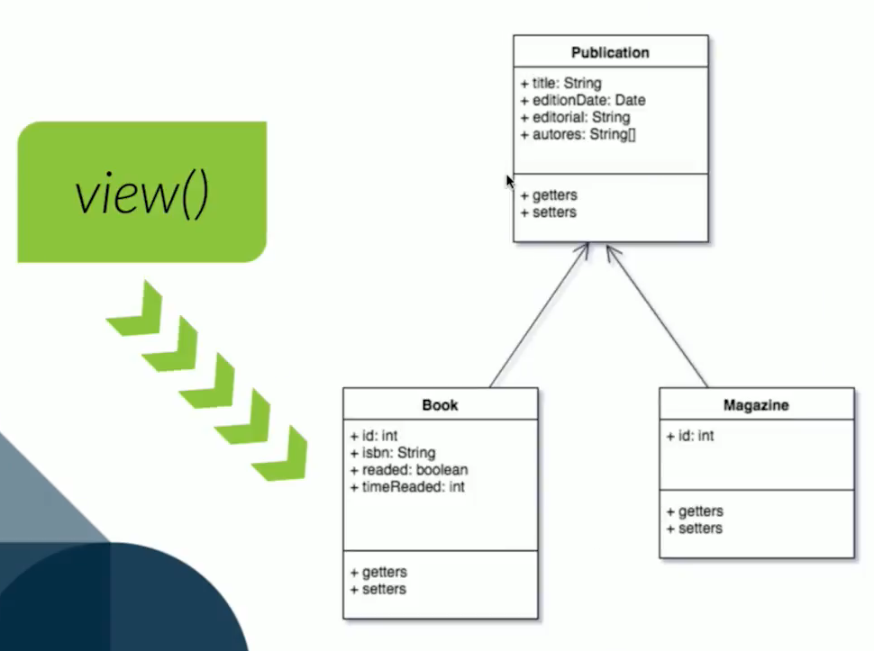
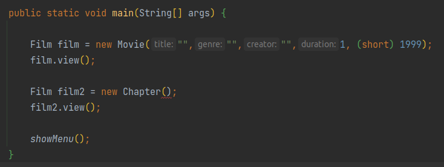
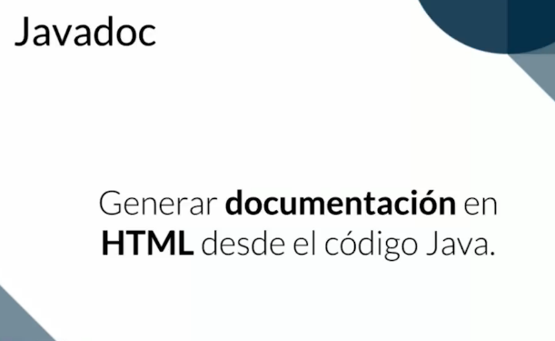
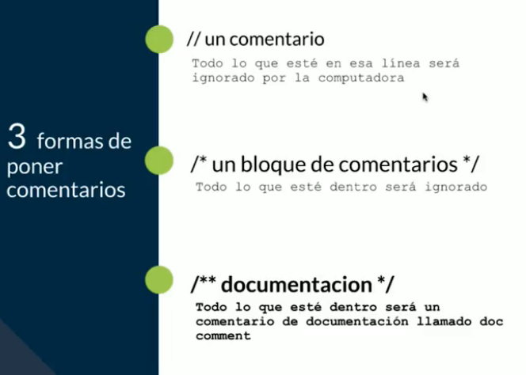
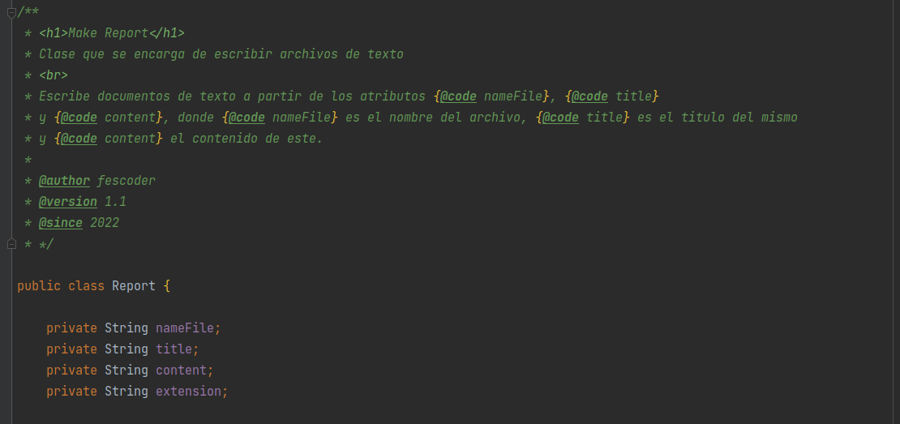
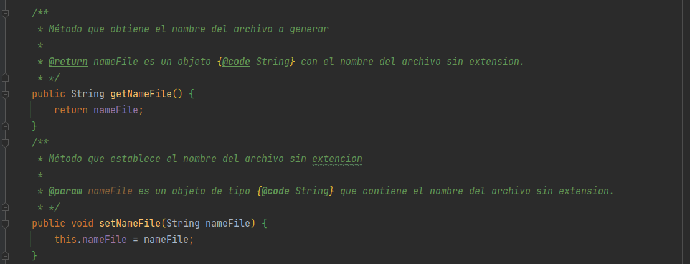
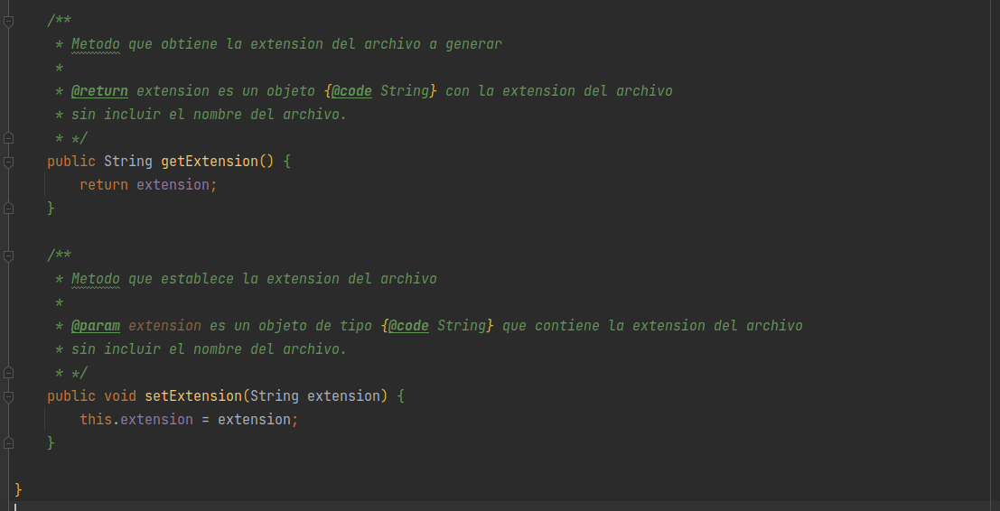
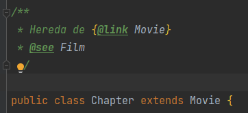

# Curso de Avanzado de Java SE
Índice
-
- [Módulo 2 - Clases avanzadas](#módulo-2---clases-avanzadas)
    - [Clase 2 - Clases Abstractas](#clase-2---clases-abstractas)
    - [Clase 3 - Implementando clases abstractas al proyecto](#clase-3---implementando-clases-abstractas-al-proyecto)
    - [Clase 4 - Ejercicio. Clases Abstractas](#clase-4---ejercicio-clases-abstractas)
    - [Clase 5 - Implementando métodos abstractos en Java](#clase-5---implementando-métodos-abstractos-en-java)
- [Módulo 3 - JavaDocs](#módulo-3---javadocs)
    - [Clase 6 - Qué es JavaDocs](#clase-6---qué-es-javadocs)
    - [Clase 7 - Implementando JavaDocs al proyecto](#clase-7---implementando-javadocs-al-proyecto)
    - [Clase 8 - Reto](#clase-8---reto)
    - [Clase 9 - JavaDocs tags para herencia e interfaces](#clase-9---javadocs-tags-para-herencia-e-interfaces)
    - [Clase 10 - Generado Java Docs](#clase-10---generado-java-docs)
- [Módulo 4 - Clases Anidadas](#módulo-4---clases-anidadas)
    - [Clase 11 - Clases anidadas y tipos](#clase-11---clases-anidadas-y-tipos)
    - [Clase 12 - Ejercicio. Clases Anidadas](#clase-12---ejercicio-clases-anidadas)
    - [Clase 13 - Implementando una clase anidada al proyecto](#clase-13---implementando-una-clase-anidada-al-proyecto)
    - [Clase 14 - Instanciando clases estáticas anidadas](#clase-14---instanciando-clases-estáticas-anidadas)
    - [Clase 15 - Enumerations](#clase-15---enumerations)
- [Módulo 5 - Interfaces Avanzadas](#módulo-5---interfaces-avanzadas)
    - [Clase 16 - Métodos con implementación métodos default y private](#clase-16---métodos-con-implementación-métodos-default-y-private)
    - [Clase 17 - Creando Interfaz DAO con métodos default y private](#clase-17---creando-interfaz-dao-con-métodos-default-y-private)
    - [Clase 18 - Ejercicio. Interfaz DAO](#clase-18---ejercicio-interfaz-dao)
    - [Clase 19 - Diferencia Interfaces y Clases Abstractas](#clase-19---diferencia-interfaces-y-clases-abstractas)
    - [Clase 20 - Herencia en Interfaces](#clase-20---herencia-en-interfaces)
- [Módulo 6 - Colecciones Avanzadas](#módulo-6---colecciones-avanzadas)
    - [Clase 21 - Map, HashMap, TreeMap y LinkedHashMap](#clase-21---map-hashmap-treemap-y-linkedhashmap)
- [Módulo 7 - Excepciones](#módulo-7---excepciones)
    - [Clase 22 - Manejo de errores](#clase-22---manejo-de-errores)
    - [Clase 23 - Try-catch-finally / Try-with-resources](#clase-23---try-catch-finally--try-with-resources)
- [Módulo 8 - JDBC](#módulo-8---jdbc)
    - [Clase 24 - Definición y composición del API](#clase-24---definición-y-composición-del-api)
    - [Clase 25 - Ejercicio. JDBC API](#clase-25---ejercicio-jdbc-api)
    - [Clase 26 - Creando la base de datos y conectando el proyecto con MySQL](#clase-26---creando-la-base-de-datos-y-conectando-el-proyecto-con-mysql)
    - [Clase 27 - Generando conexión a la base de datos y creando clase de constantes](#clase-27---generando-conexión-a-la-base-de-datos-y-creando-clase-de-constantes)
    - [Clase 28 - Sentencia SELECT en Java](#clase-28---sentencia-select-en-java)
    - [Clase 29 - Sentencia SELECT con Parámetros](#clase-29---sentencia-select-con-parámetros)
    - [Clase 30 - Sentencia INSERT en Java](#clase-30---sentencia-insert-en-java)
    - [Clase 31 - Reto: Reporte por fecha](#clase-31---reto-reporte-por-fecha)
- [Módulo 9 - Lambdas](#módulo-9---lambdas)
    - [Clase 32 - Interfaces funcionales](#clase-32---interfaces-funcionales)
    - [Clase 33 - Programación Funcional](#clase-33---programación-funcional)
    - [Clase 34 - Lambdas](#clase-34---lambdas)
    - [Clase 35 - Ejercicio. Lambdas](#clase-35---ejercicio-lambdas)
    - [Clase 36 - Lambdas como variables y Recursividad](#clase-36---lambdas-como-variables-y-recursividad)
    - [Clase 37 - Stream y Filter](#clase-37---stream-y-filter)
    - [Clase 38 - Predicate y Consumer](#clase-38---predicate-y-consumer)

---

# Módulo 2 - Clases avanzadas
## Clase 2 - Clases Abstractas
Las `clases abstractas` nos ayuda a hacer mantenibles, robustos y pensarlos para nuevas implementaciones dentro del proyecto para que crezca sin necesidad de muchos ajustes.

- **Polimorfismo a nivel de herencia:** En herencia se da cuando en los `métodos` se sobreescribe, decimos que ese objeto puede comportarse de una forma distinta. Pero a veces no necesitamos heredar la implementación de un `método`, cuando heredamos de una `clase` a otra automáticamente obtenia todo el comportamiento, los `métodos` heredados de la `clase` padre, también a veces no necesitamos crear la instancia de la `clase` padre porque es muy genérica y capas queremos restringirla porque no se usará.
- **Polimorfismo en `interfaces`:** Es similar a la herencia pero acá si podemos implementar todos los `métodos`. Pero a veces NO es necesario implementarlos todos.

Quien soluciona estos problemas es la `clase abstracta`.

Las `clases abstractas` es como una fusión entre las cosas que le faltan a la `interfaz` implementar y a la herencia por cubrir.

Puedo definir en una `clase abstracta` que `métodos` son obligatorios de implementar y también como restricción es que de esa `clase abstracta` no se podrá crear instancias.

Ejemplo
~~~
public abstract class Figura {
    ... abstract void dibujate();
}
~~~

Un `método` que es obligatorio implementar tiene que tener la palabra `abstract` y esto hace que automáticamente la `clase` sea `abstracta`, el `método` tampoco tendrá implementado su función, como vemos tiene parte de `interfaz` y herencia.  
Cuando se hereda puedo implementar la función de ese `método` o si quiero seguir manteniendolo abstracto, debo continuar diciendo que ese `método` es abstract y no tiene cuerpo como su padre, si no tiene `abstract` es obligatorio la implementación.

---

## Clase 3 - Implementando clases abstractas al proyecto
Importamos el proyecto desde [Github](https://github.com/anncode1/JavaSEBasico/tree/31.MakeReportAllEntities), yo lo tomé desde [acá](https://github.com/wpbreak/AmazonViewer.git) que ya esta para Intellij.

Se analizó un poco como está compuesto el proyecto y se escribió en la `clase Film` un `método abstracto`, hace a la `clase film` `abstracto`, llamado `view` que lo implementarán las `clases` `Movie`, `Serie` y `Book`.

---

## Clase 4 - Ejercicio. Clases Abstractas
Tengo un programa que dibuja figuras automáticamente.

He creado una `clase abstracta` llamada `Figura`, esta tiene un `método` llamado `dibujate()`.  
¿Qué tendría que hacer para que la `clase Triangulo` pueda sobreescribir este `método` y poner el código que haga que dibuje la forma indicada?

~~~
public abstract class Figura {
    public abstract void dibujate();
}
------------------------------------------------
public class Triangulo extends Figura{

    @Override
    public void dibujate() {
        System.out.println("Dibujar Triangulo");
    }
}
~~~

---

## Clase 5 - Implementando métodos abstractos en Java
Polimorfismo a nivel de `clases`, ya no se puede instanciar la `clase` `Film` porque ahora es abstracta.  
Pero si necesito un objeto, puedo instanciar uno que herede de `Film`.

Entonces estamos viendo el polimorfismo en su máxima expresión, el mismo objeto `Film` tiene 2 comportamientos diferentes, puede ser un `Movie` o un `Chapter`.

Se hizo las modificaciones en el código, llevando el `método view` a cada `clase` implementandola, y en el main, a través de un objeto se lo invoca.

---

# Módulo 3 - JavaDocs
## Clase 6 - Qué es JavaDocs
`JavaDocs` es la [documentación](https://www.tutorialspoint.com/java/java_documentation.htm) de `Java`, aprenderemos a generarla.

Ejemplo de documentación de **Spring**

Básicamente es para informar como funciona el sistema, los `métodos`, los `parámetros` que recibe, y toda explicación que se crea necesaria para que un usuario pueda utilizar nuestro código de manera eficiente.

`JavaDocs` funciona a base de comentarios.

La documentación que se genera también se puede incluir `html`, además de los tags, estos nos sirve mucho para dar un buen formato a la documentación.

Algunos tags de `Javadoc`:
~~~
@author
{@docRoot}
@deprecated
@exception
{@inheritDoc}
{@link}
{@linkplain}
@param
@return
@see
@serial
@serialData
@serialField
@since
@throws
{@value}
@version
~~~

Ejemplo de documentación de la `clase String`
~~~
/**
 * The {@code String} class represents character strings. All
 * string literals in Java programs, such as {@code "abc"}, are
 * implemented as instances of this class.
 * 

 * Strings are constant; their values cannot be changed after they
 * are created. String buffers support mutable strings.
 * Because String objects are immutable they can be shared. For example:
 * <blockquote><pre>
 *     String str = "abc";
 * </pre></blockquote>

 * is equivalent to:
 * <blockquote><pre>
 *     char data[] = {'a', 'b', 'c'};
 *     String str = new String(data);
 * </pre></blockquote>

 * Here are some more examples of how strings can be used:
 * <blockquote><pre>
 *     System.out.println("abc");
 *     String cde = "cde";
 *     System.out.println("abc" + cde);
 *     String c = "abc".substring(2,3);
 *     String d = cde.substring(1, 2);
 * </pre></blockquote>
 * 

 * The class {@code String} includes methods for examining
 * individual characters of the sequence, for comparing strings, for
 * searching strings, for extracting substrings, and for creating a
 * copy of a string with all characters translated to uppercase or to
 * lowercase. Case mapping is based on the Unicode Standard version
 * specified by the {@link java.lang.Character Character} class.
 * 

 * The Java language provides special support for the string
 * concatenation operator (&nbsp;+&nbsp;), and for conversion of
 * other objects to strings. String concatenation is implemented
 * through the {@code StringBuilder}(or {@code StringBuffer})
 * class and its {@code append} method.
 * String conversions are implemented through the method
 * {@code toString}, defined by {@code Object} and
 * inherited by all classes in Java. For additional information on
 * string concatenation and conversion, see Gosling, Joy, and Steele,
 * <i>The Java Language Specification</i>.
 *
 * 
 Unless otherwise noted, passing a <tt>null</tt> argument to a constructor
 * or method in this class will cause a {@link NullPointerException} to be
 * thrown.
 *
 * 
A {@code String} represents a string in the UTF-16 format
 * in which <em>supplementary characters</em> are represented by <em>surrogate
 * pairs</em> (see the section <a href="Character.html#unicode">Unicode
 * Character Representations</a> in the {@code Character} class for
 * more information).
 * Index values refer to {@code char} code units, so a supplementary
 * character uses two positions in a {@code String}.
 * 
The {@code String} class provides methods for dealing with
 * Unicode code points (i.e., characters), in addition to those for
 * dealing with Unicode code units (i.e., {@code char} values).
 *
 * @author  Lee Boynton
 * @author  Arthur van Hoff
 * @author  Martin Buchholz
 * @author  Ulf Zibis
 * @see     java.lang.Object#toString()
 * @see     java.lang.StringBuffer
 * @see     java.lang.StringBuilder
 * @see     java.nio.charset.Charset
 * @since   JDK1.0
 */
 ~~~

---

## Clase 7 - Implementando JavaDocs al proyecto
Ejemplo de documentación de clase

Ejemplo de documentación de métodos

---

## Clase 8 - Reto
Ahora que ya conoces las `tags` y su uso para documentar, te pongo el siguiente reto que consiste en general la documentación para librería `Report`, que creamos en el Curso Básico de Java SE el proyecto lo encuentras [aquí](https://github.com/anncode1/JavaSEBasico/tree/26.EscribirArchivos).

Genera la librería documentada e implementala en el proyecto.

---

## Clase 9 - JavaDocs tags para herencia e interfaces

Muestra de como se ven las documentaciones y un nuevo tag.

`{@inheritDoc}` Trae toda la ascendencia de `view()` en este caso, se ve reflejado en donde dice **Specified by**.

Sin `{@inheritDoc}`

---

## Clase 10 - Generado Java Docs
En `Chapter` tenemos una doble herencia, es decir, `Chapter` -> `Movie` -> `Film`, entonces lo que podemos hacer es usar la etiqueta `@see` que lo que hace es recomendarte ver `Film` en este caso ya que es la `clase` más alta.

Generamos el JavaDocs, en Intellij está en `Tools` -> `Generate JavaDocs...`, le indicamos donde lo guardamos y `Generate`.

Abriendo en el navegador podremos ver algo como esto:

Descripción `método view` de `Film`

`IVisualizable`

---

# Módulo 4 - Clases Anidadas
## Clase 11 - Clases anidadas y tipos

Generalmente se hace esto cuando una `clase` está usando otra, esto depende mucho del modelo de negocio, y la `claseAnidada` no es usada por otras `clases`, nos muestra legiblemente la dependencia de una `clase` con la otra.  
La `claseAnidada` es de poco tamaño, menor magnitud.

Acá podemos ver como de las `clases anidadas` (`Nested Classes`) se despligan 2 tipos:
- `Inner Classes`: Clases interiores/internas y se dividen en 3.
    - `Inner Classes`: Clase normal como aparece en `ClaseAnidada`.
    - `Method local Inner classes`: una clase dentro de un método.
    - `Anonymous Inner classes`: clases abstractas, lamdas.
- `Static Nested Classes`: Clases estáticas.

Clase estática e interna

Las `clases estáticas` no necesitan crear instancias para llamarlas y solo pueden llamar a métodos estáticos.

Clases anidadas

Clases locales al método

Clases anónimas

---

## Clase 12 - Ejercicio. Clases Anidadas

---

## Clase 13 - Implementando una clase anidada al proyecto

---

## Clase 14 - Instanciando clases estáticas anidadas

---

## Clase 15 - Enumerations

---

# Módulo 5 - Interfaces Avanzadas
## Clase 16 - Métodos con implementación métodos default y private

---

## Clase 17 - Creando Interfaz DAO con métodos default y private

---

## Clase 18 - Ejercicio. Interfaz DAO

---

## Clase 19 - Diferencia Interfaces y Clases Abstractas

--

## Clase 20 - Herencia en Interfaces

---

# Módulo 6 - Colecciones Avanzadas
## Clase 21 - Map, HashMap, TreeMap y LinkedHashMap

---

# Módulo 7 - Excepciones
## Clase 22 - Manejo de errores

---

## Clase 23 - Try-catch-finally / Try-with-resources

---

# Módulo 8 - JDBC
## Clase 24 - Definición y composición del API

---

## Clase 25 - Ejercicio. JDBC API

---

## Clase 26 - Creando la base de datos y conectando el proyecto con MySQL

---

## Clase 27 - Generando conexión a la base de datos y creando clase de constantes

---

## Clase 28 - Sentencia SELECT en Java

---

## Clase 29 - Sentencia SELECT con Parámetros

---

## Clase 30 - Sentencia INSERT en Java

---

## Clase 31 - Reto: Reporte por fecha

---

# Módulo 9 - Lambdas
## Clase 32 - Interfaces funcionales

---

## Clase 33 - Programación Funcional

---

## Clase 34 - Lambdas

---

## Clase 35 - Ejercicio. Lambdas

---

## Clase 36 - Lambdas como variables y Recursividad

---

## Clase 37 - Stream y Filter

---

## Clase 38 - Predicate y Consumer

---