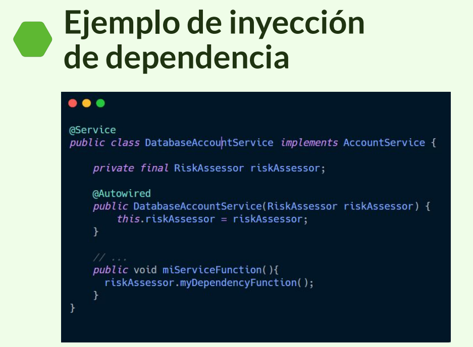
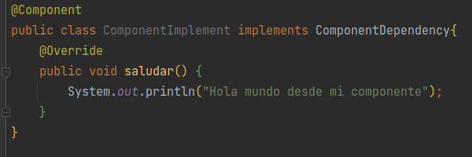
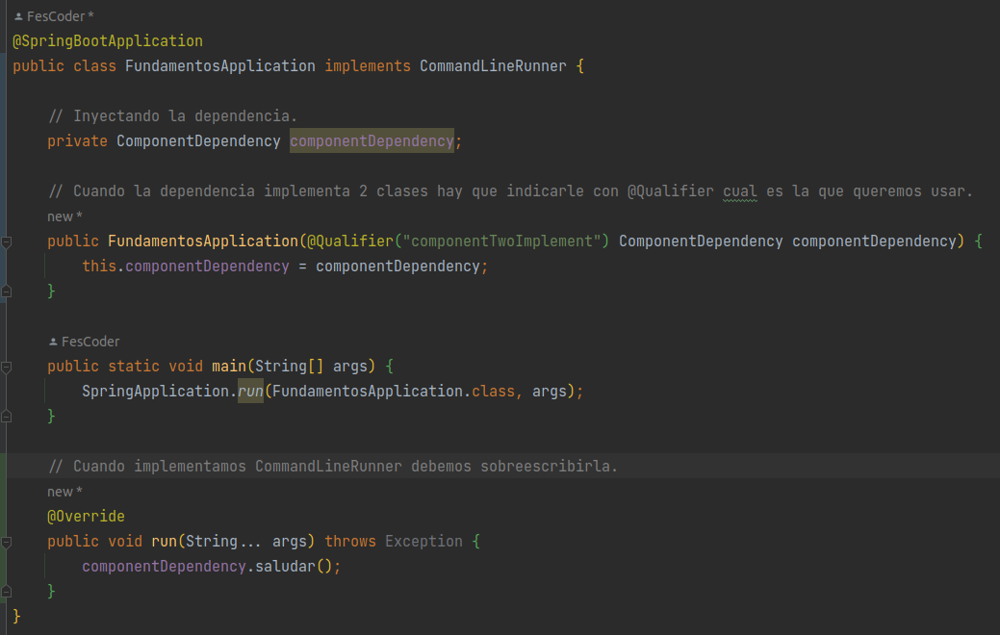
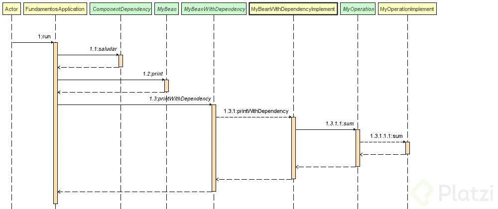

# Curso de Fundamentos de Java Spring Boot
Índice
-
- [Módulo 1 - Introducción a Spring Boot](#módulo-1---introducción-a-spring-boot)
    - [Clase 1 - ¿Qué es Spring Boot?](#clase-1---¿qué-es-spring-boot)
    - [Clase 2 - Características principales de Spring Boot](#clase-2---características-principales-de-spring-boot)
    - [Clase 3 - Instalación de entorno de desarrollo: Windows](#clase-3---instalación-de-entorno-de-desarrollo-windows)
    - [Clase 4 - Instalación de entorno de desarrollo: macOS](#clase-4---instalación-de-entorno-de-desarrollo-macos)
    - [Clase 5 - Instalación de entorno de desarrollo: Ubuntu](#clase-5---instalación-de-entorno-de-desarrollo-ubuntu)
- [Módulo 2 - Dependencias en Spring Boot](#módulo-2---dependencias-en-spring-boot)
    - [Clase 6 - ¿Qué es una dependencia?](#clase-6---¿qué-es-una-dependencia)
    - [Clase 7 - Inversión de control y el patrón de inyección de dependencias](#clase-7---inversión-de-control-y-el-patrón-de-inyección-de-dependencias)
    - [Clase 8 - Autoconfiguration y runtime](#clase-8---autoconfiguration-y-runtime)
    - [Clase 9 - Anotaciones para indicar dependencias en Spring Boot](#clase-9---anotaciones-para-indicar-dependencias-en-spring-boot)
    - [Clase 10 - Creación de proyecto bajo arquitectura de dependencias](#clase-10---creación-de-proyecto-bajo-arquitectura-de-dependencias)
    - [Clase 11 - Inyección de dependencia "Component"](#clase-11---inyección-de-dependencia-"component")
    - [Clase 12 - Ejemplo de creación de dependencia propia](#clase-12---ejemplo-de-creación-de-dependencia-propia)
- [Módulo 3 - Configuración general de Spring Boot](#módulo-3---configuración-general-de-spring-boot)
    - [Clase 13 - Cambio de puerto y path](#clase-13---cambio-de-puerto-y-path)
    - [Clase 14 - Uso de properties y valores](#clase-14---uso-de-properties-y-valores)
    - [Clase 15 - Uso de properties con ejemplo de generación de POJO](#clase-15---uso-de-properties-con-ejemplo-de-generación-de-pojo)
    - [Clase 16 - Qué son los logs y cómo usarlos](#clase-16---qué-son-los-logs-y-cómo-usarlos)
- [Módulo 4 - JPA con Spring y Spring Data](#módulo-4---jpa-con-spring-y-spring-data)
    - [Clase 17 - Modelado de entidades con JPA](#clase-17---modelado-de-entidades-con-jpa)
    - [Clase 18 - Configuración de datasource con properties y classes](#clase-18---configuración-de-datasource-con-properties-y-classes)
    - [Clase 19 - Registro en base de datos con JpaRepository](#clase-19---registro-en-base-de-datos-con-jparepository)
    - [Clase 20 - Uso de JPQL en anotación query](#clase-20---uso-de-jpql-en-anotación-query)
    - [Clase 21 - Uso de anotación value para apuntar a properties](#clase-21---uso-de-anotación-value-para-apuntar-a-properties)
    - [Clase 22 - Obtención de información usando Query methods](#clase-22---obtención-de-información-usando-query-methods)
    - [Clase 23 - Uso de Query methods con Or, and, OrderBy, Between, Sort](#clase-23---uso-de-query-methods-con-or-and-orderby-between-sort)
    - [Clase 24 - Uso de JPQL con named parameters](#clase-24---uso-de-jpql-con-named-parameters)
    - [Clase 25 - Uso de anotación transactional](#clase-25---uso-de-anotación-transactional)
    - [Clase 26 - Rollback con la anotación transactional](#clase-26---rollback-con-la-anotación-transactional)
- [Módulo 5 - REST con Spring Boot](#módulo-5---rest-con-spring-boot)
    - [Clase 27 - CRUD bajo arquitectura REST](#clase-27---crud-bajo-arquitectura-rest)
    - [Clase 28 - Métodos CREATE, UPDATE y DELETE](#clase-28---métodos-create-update-y-delete)
    - [Clase 29 - Probando la API REST](#clase-29---probando-la-api-rest)
    - [Clase 30 - Pagination con Spring Boot](#clase-30---pagination-con-spring-boot)

---

[PDF](https://static.platzi.com/media/public/uploads/slides-fundamentos-springboot_d43cc29e-5845-48a5-a0a2-f182c2ce13dc.pdf)

# Módulo 1 - Introducción a Spring Boot
## Clase 1 - ¿Qué es Spring Boot?
- **Spring Boot** es un proyecto basado en **Spring**, no es lo mismo que **Spring**. Es un proyecto que forma parte del core de **Spring**, al igual que Spring Cloud, Spring Security, Spring Data, etc.
- El objetivo principal es que sólo te centres en correr la aplicación, sin preocuparte por temas de configuración, etc.
- Tiene la gran ventaja poder integrar librerías de terceros de manera muy sencilla.
- No tendremos que preocuparnos por configuraciones a nivel de XML, sólo configuraciones mínimas a nivel de properties (ponerle el puerto, etc).
- No tendremos que preocuparnos de desplegar nuestra aplicación en un servidor web local cuando queramos hacer pruebas, Spring Boot también contempla esto y lleva incorporado un servidor web dónde se desplegará nuestra aplicación automáticamente.

---

## Clase 2 - Características principales de Spring Boot
Características principales de **Spring Boot**:
- **Independiente**: no tenemos que preocuparnos de las dependencias del core de Spring ni de la compilación de estas.
- **Incrustado Tomcat, Jetty o Undertow**: Spring Boot trae consigo un servidor web como los tres mencionados donde podemos correr nuestra aplicación sin preocuparnos de generar un artefacto `WAR` o `JAR` y desplegarlo nosotros mismos.
- **Proporción de dependencias**: no debemos preocuparnos por las configuraciones de dependencias de terceros o del core de Spring, Spring Boot se encargará de inyectar todo lo necesario.
- **Sin generación de XML**: No debemos preocuparnos de configuración XML para que nuestra aplicación funcione.
- **Métricas de salud del aplicativo**: podemos validar el estado de un servicio desplegado, sus dependencias, estado de memoria, magnitud de configuración, etc.

---

## Clase 3 - Instalación de entorno de desarrollo: Windows

---

## Clase 4 - Instalación de entorno de desarrollo: macOS

---

## Clase 5 - Instalación de entorno de desarrollo: Ubuntu

---

# Módulo 2 - Dependencias en Spring Boot
## Clase 6 - ¿Qué es una dependencia?
- Objetos definidos como una funcionalidad, sin la cual, los otros objetos no podrían trabajar, ya que dependen de ella.  
Por ejemplo, un volante es una dependencia de un vehículo, ya que sin volante, no podemos conducir el vehículo.
- Las dependencias nos permiten modularizar nuestra aplicación, lo cual nos beneficia en las pruebas unitarias.

**Alta cohesión**: Involucra que la entidad ejecute sus acciones sin involucrar otra clase o entidad.

**Bajo acoplamiento**: Hablamos de acoplamiento bajo cuando existe una independencia entre los componentes entre si, por el contrario un alto acoplamiento es cuando tenemos varias dependencias relacionadas a un solo componente.  
Entonces podemos afirmar que en la definición de un buen diseño de software se debe tener una ALTA COHESIÓN y un BAJO ACOPLAMIENTO.

---

## Clase 7 - Inversión de control y el patrón de inyección de dependencias
[Video explicativo](https://www.youtube.com/watch?v=-Cs1HN6pEg4&list=PLU8oAlHdN5Blq85GIxtKjIXdfHPksV_Hm&index=7)

**Inversion of Control (IoC)**: Delegando responsabilidades  
Se refiere a todo aquel diseño de software cuyo propósito obedece a la necesidad de querer controlar el flujo de ejecución de este, de forma automática y transparente, es decir, ceder el control de ese flujo a un “agente externo”, normalmente un framework.

"No nos llame, nosotros lo llamamos."  
Se refiere a la transferencia del control del flujo de un programa a un contenedor o framework.
- En un website o una app móvil el contenedor sería el usuario.

**Ventajas**
- Facil testing por componentes o mocks de dependencias.
- Mayor modularización.
- Desacoplamiento cuando lo objetos cuentan con sus dependencias.
- Segregación de interfaces.

IoC en el contexto de spring boot
- Los objetos que son administrados por el contenedor, spring boot los denomina `beans`. Un `bean` seria los objetos administrados por el usuario en un website.
- Un bean es un objeto el cual es instanciado, ensamblado y administrado por el contenedor de spring IoC.

**Dependency Injection (DI)**: Inyectando componentes  
`DI` es un patrón de diseño que sirve para “inyectar” componentes a las clases que tenemos implementadas. Esos componentes son contratos que necesitan nuestras clases para poder funcionar, de ahí el concepto de “dependencia”. La diferencia sustancial en este patrón de diseño es que nuestras clases no crearán esos objetos que necesitan, sino que se les suministrará otra clase “contenedora” perteneciente al Framework DI que estemos utilizando y que inyectarán la implementación deseada a nuestro contrato, y todo ello sin tener que hacer un solo `new`.

Es el patrón que utiliza IoC para utilizar las dependencias anteriormente instanciadas por el contenedor de spring.

Un `bean` es una dependencia, un `método`, un `objeto`.  
Los `beans` básicamente son módulos desarrollados en Spring estos se encargan de brindarnos toda la lógica que necesitamos para nuestra aplicación. Ejemplo: Si necesitamos referenciar que nuestra clase es un modelo hacemos uso de el `bean` `@entity` . Esto nos permite usar propiedades creadas para este tipo de modulo que nos agilizan nuestro desarrollo. Al hacer inversión de control nosotros al llamar esos `beans` lo que hacemos es referenciar módulos funcionales creados por spring. Spring boot nos facilita el fácil instanciamiento de estos a nuestra aplicación.

Spring Boot es el proyecto de Spring, y Spring se encarga de manera abstracta de iniciarlizar los `beans`.

---

`@Autowired` es muy imporante al momento de autocablear nuestras soluciones, no es tan recomendada para nuestros proyectos, pero la verdad la idea es hacer el código menos verboso y esto simplifica muchísimo el código fuente.
Por otra parte, `@Qualifier` es una anotación que sirve para especificar el tipo de dependencia se esta inyectando con la funcionalidad de diferenciar nuestras abstracciones o uso de clases que implementan una misma interfaz (Según el principio SOLID) porque si usamos concreciones no seria util usar Qualifiers en la mayoría de los casos.

---

## Clase 8 - Autoconfiguration y runtime
Configura automáticamente tus aplicaciones basadas en dependencias `JAR` que agregaste mediante el `pom.xml`, pero si nosotros realizamos una configuración manual esta es priorizada por Spring Boot.

---

## Clase 9 - Anotaciones para indicar dependencias en Spring Boot
Una Anotación es una forma de añadir metadatos al código fuente `Java` que están disponibles para la aplicación en tiempo de ejecución o de compilación.

**TIPOS DE ANOTACIONES**
- @Controller: Para indicar que esta será la `clase` que gestionara las peticiones del usuario por `get`, `post`, `put`, `patch` o `delete`.
- @Service: Con esta notación especificamos que en esta `clase` se encontrara toda nuestra lógica de negocio, cálculos o llamadas a otras `API` externas.
- @Repository: Se usa para las `clases` o `interfaces` que funcionaran con el acceso a la base de datos.

Si nuestra `clase` o `interfaz` no tiene una especificación clara como `@Service`, `@Repository` o `@Controller`, simplemente recurrimos a `@Component` y le indicamos que sencillamente es un componente.

Por otro lado, no es estrictamente necesario que cumplas con colocar una notación especifica, pero es una buena practica.

---

Diferencias entre las anotaciones:
- @Component: Es un bean que es reconocido por el componentScan de Spring para su inicialización.

Todas las demás son meta anotaciones de @Component, pero con algunas diferencias:
- @Repository captura automáticamente las excepciones con la BD por medio de DataAccessExeption.
- @Sevice Solo se nombra para separación de responsabilidades.
- @Controller Igual que el anterior, pero además indica a spring que se trata de una clase que sirve métodos HTTP.

---

## Clase 10 - Creación de proyecto bajo arquitectura de dependencias
[Inicializador](https://start.spring.io/) por defecto para crear proyectos con Spring Boot.

Descargamos el `ZIP`, lo descompriminos y lo abrimos con **Intellij**. Creamos el repositorio para el proyecto en GitHub, y las carpetas de la anotaciones dentro del sistema.

---

## Clase 11 - Inyección de dependencia "Component"
Creamos las siguientes `Clases`, inyactamos dependencia y probamos.

---

## Clase 12 - Ejemplo de creación de dependencia propia
Primero creamos una `interfaz` que tendrá una `función` para implementar.

Creamos la `Clase` que implemente la `interfaz`.

Podemos tener otra `Clase` con otra implementación.

Creamos una `clase` de `configuración` para administrar nuestras `dependencias`.  
Ahora como tenemos 2 implementaciones diferentes, vamos a decir cual es la que se ejecutará.

En `FundamentosApplication`, nuestro `main`, instanciamos y ejecutamos.  
Para inyectar la dependencia, crear una `variable` y agregarlo al `constructor`.

**Una dependencia dentro de otra**  
En este caso tenemos a `MyOperation` insertada en `MyBeanWithDependency`.

La `interface`

La `clase`

La `interface` `MyBeanWithDependency`

La `clase` donde se inyecta `MyOperation`

Diagrama secuencial de flujo.

---

# Módulo 3 - Configuración general de Spring Boot
## Clase 13 - Cambio de puerto y path

---

## Clase 14 - Uso de properties y valores

---

## Clase 15 - Uso de properties con ejemplo de generación de POJO

---

## Clase 16 - Qué son los logs y cómo usarlos

---

# Módulo 4 - JPA con Spring y Spring Data
## Clase 17 - Modelado de entidades con JPA

---

## Clase 18 - Configuración de datasource con properties y classes

---

## Clase 19 - Registro en base de datos con JpaRepository

---

## Clase 20 - Uso de JPQL en anotación query

---

## Clase 21 - Uso de anotación value para apuntar a properties

---

## Clase 22 - Obtención de información usando Query methods

---

## Clase 23 - Uso de Query methods con Or, and, OrderBy, Between, Sort

---

## Clase 24 - Uso de JPQL con named parameters

---

## Clase 25 - Uso de anotación transactional

---

## Clase 26 - Rollback con la anotación transactional

---

# Módulo 5 - REST con Spring Boot
## Clase 27 - CRUD bajo arquitectura REST

---

## Clase 28 - Métodos CREATE, UPDATE y DELETE

---

## Clase 29 - Probando la API REST

---

## Clase 30 - Pagination con Spring Boot

---