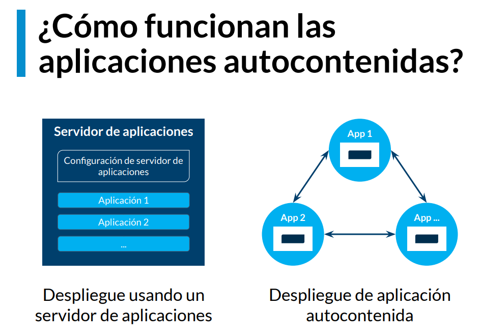
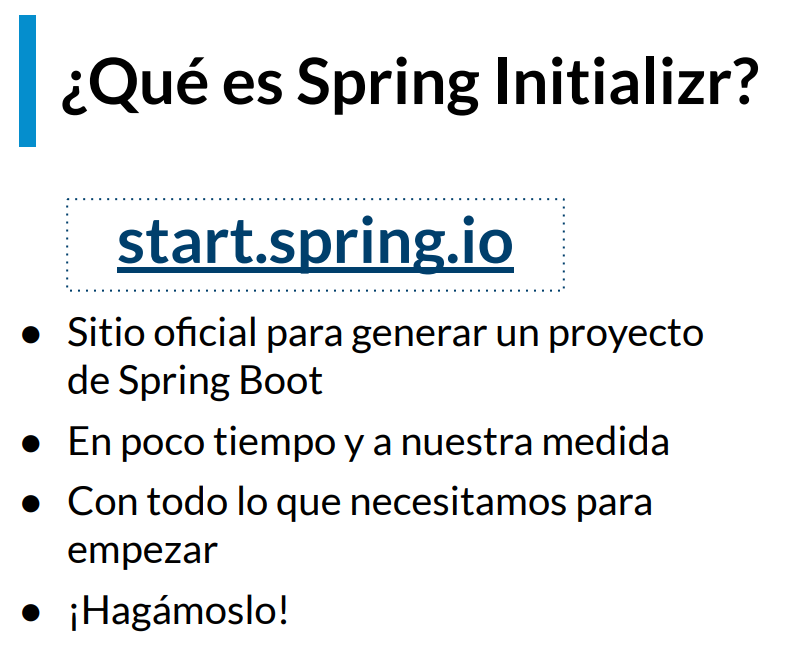
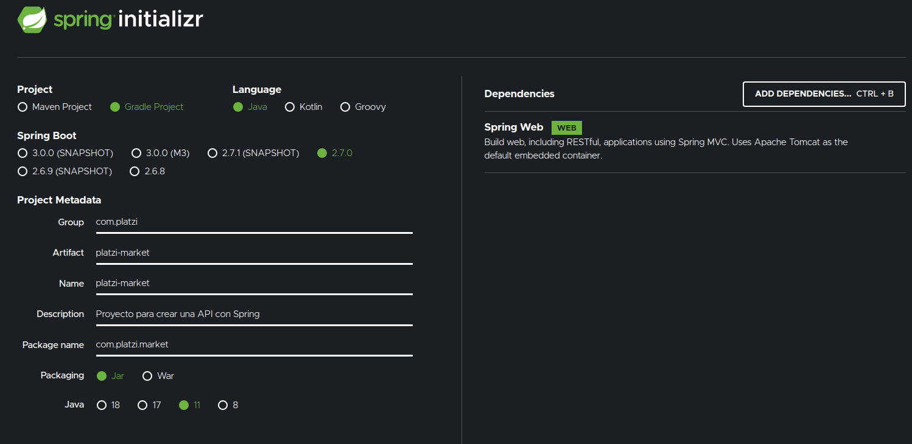
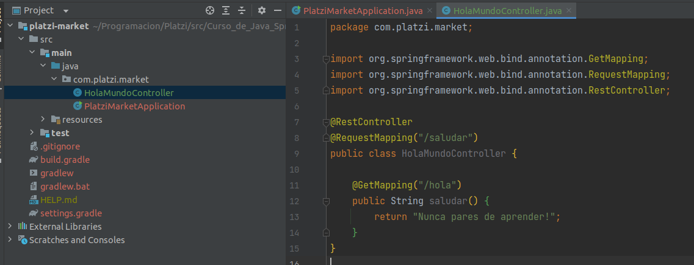
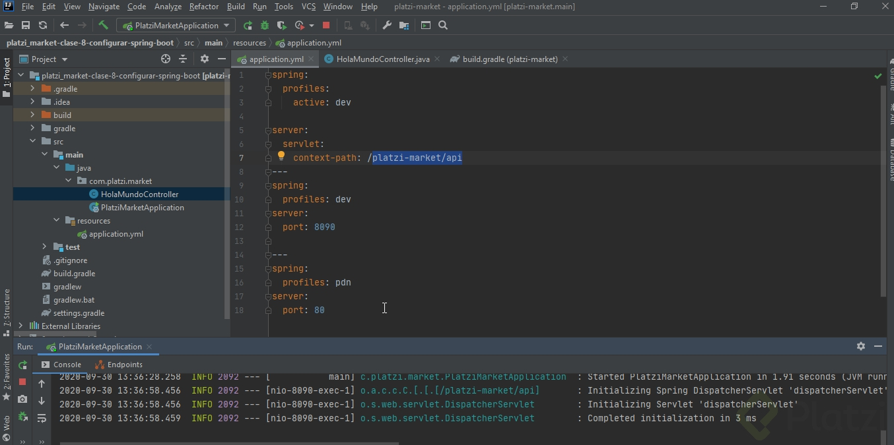
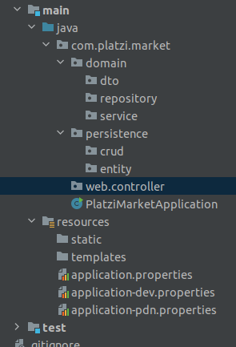

# Curso de Java Spring
Índice
-
- [Módulo 2 - Introducción a Spring boot](#módulo-2---introducción-a-spring-boot)
    - [Clase 6 - ¿Qué es y qué usaremos de Spring?](#clase-6---¿qué-es-y-qué-usaremos-de-spring)
    - [Clase 7 - Conocer qué es una aplicación autocontenida](#clase-7---conocer-qué-es-una-aplicación-autocontenida)
    - [Clase 8 - Crear nuestra aplicación con Spring Initializr](#clase-8---crear-nuestra-aplicación-con-spring-initializr)
    - [Clase 9 - Hola mundo con Spring Boot](#clase-9---hola-mundo-con-spring-boot)
    - [Clase 10 - Configurar Spring Boot](#clase-10---configurar-spring-boot)
    - [Clase 11 - Crear la estructura del proyecto](#clase-11---crear-la-estructura-del-proyecto)
- [Módulo 3 - Spring Data](#módulo-3---spring-data)
    - [Clase 12 - ¿Qué es JPA?](#clase-12---¿qué-es-jpa)
    - [Clase 13 - Conocer qué es Spring Data](#clase-13---conocer-qué-es-spring-data)
    - [Clase 14 - Conectar la base de datos a nuestra aplicación](#clase-14---conectar-la-base-de-datos-a-nuestra-aplicación)
    - [Clase 15 - Mapear las tablas como clases](#clase-15---mapear-las-tablas-como-clases)
    - [Clase 16 - Crear Entity cuando su clave primaria es compuesta](#clase-16---crear-entity-cuando-su-clave-primaria-es-compuesta)
    - [Clase 17 - Mapear relaciones entre clases](#clase-17---mapear-relaciones-entre-clases)
    - [Clase 18 - Usar la interface CrudRepository](#clase-18---usar-la-interface-crudrepository)
    - [Clase 19 - Query Methods](#clase-19---query-methods)
- [Módulo 4 - Construyendo nuestra API](#módulo-4---construyendo-nuestra-api)
    - [Clase 20 - Implementar la anotación @Repository](#clase-20---implementar-la-anotación-repository)
    - [Clase 21 - ¿Qué es el patrón Data Mapper y qué resuelve?](#clase-21---¿qué-es-el-patrón-data-mapper-y-qué-resuelve)
    - [Clase 22 - Orientar nuestra API al dominio con MapStruct](#clase-22---orientar-nuestra-api-al-dominio-con-mapstruct)
    - [Clase 23 - Orientar nuestro repositorio a términos del dominio](#clase-23---orientar-nuestro-repositorio-a-términos-del-dominio)
    - [Clase 24 - Inyección de dependencias](#clase-24---inyección-de-dependencias)
    - [Clase 25 - Implementar la anotación @Service](#clase-25---implementar-la-anotación-service)
    - [Clase 26 - Implementar la anotación @RestController](#clase-26---implementar-la-anotación-restcontroller)
    - [Clase 27 - Exponer nuestra API](#clase-27---exponer-nuestra-api)
- [Módulo 5 - Mejorando nuestra API](#módulo-5---mejorando-nuestra-api)
    - [Clase 28 - Controlar las respuestas HTTP](#clase-28---controlar-las-respuestas-http)
    - [Clase 29 - Crear el dominio de compras](#clase-29---crear-el-dominio-de-compras)
    - [Clase 30 - Mapear el dominio de compras](#clase-30---mapear-el-dominio-de-compras)
    - [Clase 31 - Crear el repositorio de compras](#clase-31---crear-el-repositorio-de-compras)
    - [Clase 32 - Probando nuestros servicios de compras](#clase-32---probando-nuestros-servicios-de-compras)
    - [Clase 33 - Documentar nuestra API con Swagger](#clase-33---documentar-nuestra-api-con-swagger)
- [Módulo 6 - Spring Security](#módulo-6---spring-security)
    - [Clase 34 - Configurar la seguridad de nuestra API con Spring Security](#clase-34---configurar-la-seguridad-de-nuestra-api-con-spring-security)
    - [Clase 35 - Generar un JWT](#clase-35---generar-un-jwt)
    - [Clase 36 - Autenticación con JWT](#clase-36---autenticación-con-jwt)
    - [Clase 37 - Autorización con JWT](#clase-37---autorización-con-jwt)
- [Módulo 7 - Despliegue de nuestra aplicación](#módulo-7---despliegue-de-nuestra-aplicación)
    - [Clase 38 - Desplegar nuestra API desde la ventana de comandos](#clase-38---desplegar-nuestra-api-desde-la-ventana-de-comandos)
    - [Clase 39 - Desplegar nuestra base de datos con Heroku](#clase-39---desplegar-nuestra-base-de-datos-con-heroku)
    - [Clase 40 - Desplegar nuestra API con Heroku](#clase-40---desplegar-nuestra-api-con-heroku)

---

[PDF del curso](https://static.platzi.com/media/public/uploads/presentacion_curso-de-java-spring_76d8fbd4-ad4a-4542-8751-a472edefcf82.pdf)

# Módulo 2 - Introducción a Spring boot
## Clase 6 - ¿Qué es y qué usaremos de Spring?

- **Framework** es una estructura que nos ayuda a trabajar de una manera más sencilla con algo, en este caso con `Java`. Nos dá herramientas para hacer desarrollos avanzados, utilizando menos código, mejores prácticas en menor tiempo.

- **Spring** es el framework más usado de `Java`, y nos dá herramientas a los desarrolladores para que nos ocupemos por lo que es importante y es crear un código increible, delegandole a `Spring` tareas repetitivas o de los cuales uno de los subporyectos de `Spring` se pueda encargar.

- También posee una gran comunidad, lo que nos brinda muchísima documentación y ayuda.

- `Spring` contiene cerca de 30 proyectos internos, los cuales van desde crear app web, app reactivas o procesamientos de grandes lotes de información con `Batch`.

- `Spring` tiene una estructura modular y flexible, lo que nos hace usar solo lo que necesitemos.

Vamos a usar 4 subproyectos de `Spring`:
- **Spring Framework**: Permite crear aplicaciones empresariales. Es transversal, ya que todos lo usan.
- **Spring Boot**: Con el que podemos crear aplicaciones autocontenidas y autoconfigurables.
- **Spring Data**: Gestionar e integrar bases de datos.
- **Spring Security**: Gestionar la seguridad de la aplicación.

[Documentación de Spring](https://spring.io/projects)

---

## Clase 7 - Conocer qué es una aplicación autocontenida

Antes las apps web empresariales lucian como la imagen izquierda, teniamos un servidor de apps configurada, también se desplegaban todas las apps que queriamos que interactuaran entre si.

Ahora las arquitecturas modernas, nos sugieren tener algo como el diagrama de la derecha, donde tengamos pequeñas apps o servicios que interactuen entre si, en vez de una gran app, esto nos da mucha facilidad para el desarrollo y mantenimiento de nuestra app.  
Cada app internamente contiene su propio servidor de apps con una configuración totalmente independiente una de la otra.

- `Spring Boot` es el proyecto de `Spring` para crear apps autocontenidas.
- Esto permite olvidarnos de la arquitectura y enfocarnos en el desarrollo delegandole a `Spring Boot` labores como configuración de dependencias o desplegar nuestro servicio o app a un servidor de aplicaciones y enfocarnos unicamente en crear el mejor código posible.
- Para esto `Spring Boot` utiliza internamente un servidor de apps embebido o contendor de apps embebido, por defecto usa `Tomcat`.
- También nos provee un completo gestor de dependencias con `Maven` o `Gradle`, configuraciones automaticas y más para que nuestra app sea a la medida

---

## Clase 8 - Crear nuestra aplicación con Spring Initializr

[Spring Initializr](https://start.spring.io/) es el sitio oficial de `Spring` para crear apps autocontenidas, nos ofrece la oportunidad de crear nuestra propia app, utilizando las dependencias que necesitemos y con muy pocos clicks.

Lo primero que vemos en `Spring Initializr` es que nos pide es el tipo de proyecto:
- `Maven`: Gestionan las dependencias con archivos `XML`.
- `Gradle`: Son escritos en `Groovy` y nos permite crear tareas que se pueden ejecutar al momento de hacer despliegue o integración continua.

Se recomienda siempre usar la versión estable de `Spring Boot`.  
También podemos incluir las dependencias que sabemos que vamos a necesitar, en este caso usaremos `Spring Web`, que me permite crear `APIs REST` usando `Apache Tomcat` como contenedor por defecto.

Tenemos varios archivos que nos descargamos con el proyecto:
- `.gitignore`: Nos sirve si queremos montar nuestro código a un servidor de versión de código, un repositorio como ***GitHub***.
- `HELP.md`: Describe brevemente nuestro proyecto.
- `build.gradle`: Escrito en `Groovy` esta toda la configuración de la app. Plugins, grupo, versión, versión de `Java`, repositorios, dependencias y pruebas que vamos a utilizar.
- `gradle`, `gradlew`, `gradlew.bat` y `settings.gradle`: Son necesarios para que `Gradle` funcione y no tenemos que interactuar con ellos.
- `src`: Contiene internamente 2 carpetas:
    - `main`: Para todo lo relacionado con el proyecto.
        - `java`: Contiene todo el paquete de `clases` `Java`.
        En este caso contiene `com/platzi/market` y dentro está `PlatziMarketApplication`, que es la `clase` que contiene el `método` `main`, y tiene la anotación `@SpringBootApplication` para indicar que es esta `clase` la que gestiona la app.
        - `resources`: Dentro está `application.properties` y acá configuramos todo lo necesario para que nuestra app se acomode a nuestro gusto, `variables` que podemos encontrar en la documentación de `Spring` o `variables` que nosotros definamos.
    - `test`: Para nuestras pruebas del proyecto.

---

## Clase 9 - Hola mundo con Spring Boot
Lo primero que hacemos es descomprimir el zip, abrimos una terminal en esa carpeta y con `git init` iniciamos el repositorio de nuestro proyecto.  
Con `git remote add origin git@github.com:FesCoder/platzi-market.git` enlazamos el repo local con el remoto.

Ahora con **Intellij IDEA** vamos a importar el proyecto, nos dirigimos a donde lo tenemos y seleccionamos `build.gradle`.  
Lo que haremos ahora es un pequeño `Controller` para probar que todo es ok y levante el servidor.

A la hora de compilar lo que hace `Spring` es crear un contendor de apps o un servidor de apps para que nuestra app pueda funcionar.
En el navegador probamos la app, por defecto el puerto que usa `Spring Boot` es el 8080, entonces escribimos `localhost:8080/saludar/hola`.

---

Es buena practica usar otro puerto distinto al 8080, hay veces pone problemas segun lo que tengas instalado y ejecutando en tu maquina.  
Y se puede cambiar en el `application.properties` con `server.port=8090`.

---

## Clase 10 - Configurar Spring Boot

- En `application.properties` podemos gestionar la configuración que va a tener nuestro proyecto, si queremos modificar el puerto por el que se ejecuta, o el context path de nuestra app, entre otras. De forma alternativa podemos usar `application.yml` directamente en la linea de comandos cuando lancemos la app.
- También existe la posibilidad de añadir nuestras propias `variables` o `atributos` para la configuración.
- Nos ofrece la capacidad de gestionar diferentes `perfiles` de acuerdo a los entornos donde estemos. Podemos crear un `perfil` que se ejecute en tiempo de desarrollo y otro que se enfoque unicamente cuando nuestra app esté en producción.

Lo primero que hacemos es modificar el puerto y el class path de nuestra `application.properties`.

El archivo `application.properties` tiene la capacidad de ser gestionado para varios entornos.  
Lo que tenemos que hacer es crear un nuevo `archivo.properties`, en este caso `application-dev.properties`, lo hacemos con `New -> File`, para que se comporte para un entorno de desarrollo y añadiremos otro para cuando sea producción, `application-pdn.properties`.  
Es importante los nombres de las properties despues del guión(`-`).

Indicaremos con que entorno queremos trabajar en `application.properties` con `spring.profiles.active=dev`, decimos que el perfil activo de `Spring` en este momento es `dev`. Y en `dev` le decimos el puerto que vamos a usar, y para producción será el puerto 80.

El atributo `class path` se va a compartir con los 2 perfiles ya que lo dejamos en `application.properties`.

Como podemos ver cuando iniciamos la app nos dice para que perfil está activo en ese momento.

En [este enlace](https://docs.spring.io/spring-boot/docs/current/reference/html/application-properties.html) tenemos todos los atributos de `Spring` que podemos modificar.

---

El tema de los perfiles en Spring Boot es fascinante. Inclusive se pueden utilizar implementaciones de objetos específicos por perfil con la ayuda de la anotación `@Profile`. [Más info.](https://docs.spring.io/spring-boot/docs/current/reference/html/spring-boot-features.html#boot-features-profiles)

Formato de configuración con `yml`.

---

## Clase 11 - Crear la estructura del proyecto
La arquitectura que usaremos será una por capas orientada al ***Dominio***, conocida como `DDD`(Domain Driven Design).

- La primera capa es la del ***Dominio***, donde vamos a tener:
    - **Los DTOs y objetos de dominio**: que son objetos que hacen parte del contexto de nuestra app, en este caso de un supermercado.
    - **Los servicios**: son los encargados de servir como puente entre los controladores de la API y la capa de persistencia o repositorio, que es quien interviene en la DB
    - **La especificación de los repositorios**: son interfaces que definen las reglas de juego o contratos, que de cumplir la persistencia, para intervenir entre los objetos de dominio y la DB.
- La otra capa es la ***Web***, en esta vamos a tener los `Controladores` de nuestra `API`. Como el que hicimos en la clase anterior.
- La última capa es la de ***Persistencia***, que es la capa que tiene la obligación de interactuar con lal DB. Acá vamos a tener los `repositorios`, que son los que van a implementar las especificaciónes que tenemos en ***Dominio*** y también los `Entities`. Los `Entities` son las clases que mapean y hacen de tablas de nuestra DB.

El flujo seria:
- Un `cliente` hace un llamado a un `Controlador` de nuestra `API`.
- El `controlador` va al `servicio`, que contiene todo lo necesario para intervenir en esa operación.
- El `Servicio` va a ir al `repositorio` que necesite, y acá es donde ocurre cuando tenemos que hacer alguna gestion o movimiento a nuestra DB.

Entonces en el proyecto creamos:
- 3 `packages` llamados `domain`, `web` y `persistence`.
    - Dentro de `domain` creamos 3 `packages` llamados `dto`, `repository` y `service`.
    - Dentro de `persistence` creamos 2 `packages` llamados `entity` y `crud`.
    - Dentro de `web` creamos 1 `package` llamado `controller`.

Con esto nuestro proyecto ya cuenta con una estructura solida, que nos permite tener un código más organizado, donde sea más facil escribir código y mantenerlo.

---

Al realizar creaciones de `paquetes` estas deben estar por debajo de la clase donde se encuentre nuestro `main` (`@SpringBootApplication`), ya que `Spring` scanea desde ese punto hacia abajo por defecto, de lo contrario se tendra que mencionar en esa misma clase la ruta que scaneara.

Para quien esté interesado en conocer un poco más sobre DDD (Domain Driven Design) [aquí](https://medium.com/@jonathanloscalzo/domain-driven-design-principios-beneficios-y-elementos-primera-parte-aad90f30aa35) les dejo un artículo introductorio que me pareció excelente para entender de una manera sencilla este patrón de desarrollo.

---

# Módulo 3 - Spring Data
## Clase 12 - ¿Qué es JPA?

---

## Clase 13 - Conocer qué es Spring Data

---

## Clase 14 - Conectar la base de datos a nuestra aplicación

---

## Clase 15 - Mapear las tablas como clases

---

## Clase 16 - Crear Entity cuando su clave primaria es compuesta

---

## Clase 17 - Mapear relaciones entre clases

---

## Clase 18 - Usar la interface CrudRepository

---

## Clase 19 - Query Methods

---

# Módulo 4 - Construyendo nuestra API
## Clase 20 - Implementar la anotación @Repository

---

## Clase 21 - ¿Qué es el patrón Data Mapper y qué resuelve?

---

## Clase 22 - Orientar nuestra API al dominio con MapStruct

---

## Clase 23 - Orientar nuestro repositorio a términos del dominio

---

## Clase 24 - Inyección de dependencias

---

## Clase 25 - Implementar la anotación @Service

---

## Clase 26 - Implementar la anotación @RestController

---

## Clase 27 - Exponer nuestra API

---

# Módulo 5 - Mejorando nuestra API
## Clase 28 - Controlar las respuestas HTTP

---

## Clase 29 - Crear el dominio de compras

---

## Clase 30 - Mapear el dominio de compras

---

## Clase 31 - Crear el repositorio de compras

---

## Clase 32 - Probando nuestros servicios de compras

---

## Clase 33 - Documentar nuestra API con Swagger

---

# Módulo 6 - Spring Security
## Clase 34 - Configurar la seguridad de nuestra API con Spring Security

---

## Clase 35 - Generar un JWT

---

## Clase 36 - Autenticación con JWT

---

## Clase 37 - Autorización con JWT

---

# Módulo 7 - Despliegue de nuestra aplicación
## Clase 38 - Desplegar nuestra API desde la ventana de comandos

---

## Clase 39 - Desplegar nuestra base de datos con Heroku

---

## Clase 40 - Desplegar nuestra API con Heroku

---