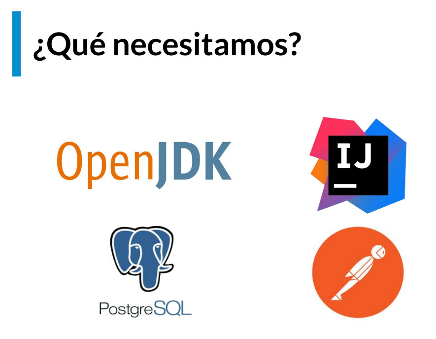
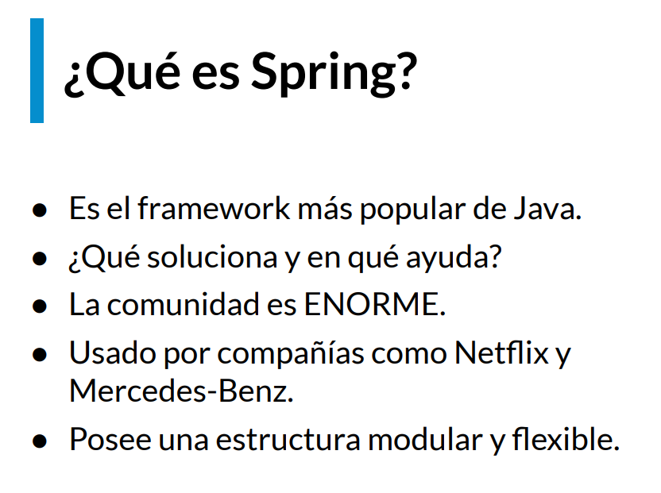

# Curso de Java Spring
Índice
-
- [Módulo 2 - Introducción a Spring boot](#módulo-2---introducción-a-spring-boot)
    - [Clase 6 - ¿Qué es y qué usaremos de Spring?](#clase-6---¿qué-es-y-qué-usaremos-de-spring)
    - [Clase 7 - Conocer qué es una aplicación autocontenida](#clase-7---conocer-qué-es-una-aplicación-autocontenida)
    - [Clase 8 - Crear nuestra aplicación con Spring Initializr](#clase-8---crear-nuestra-aplicación-con-spring-initializr)
    - [Clase 9 - Hola mundo con Spring Boot](#clase-9---hola-mundo-con-spring-boot)
    - [Clase 10 - Configurar Spring Boot](#clase-10---configurar-spring-boot)
    - [Clase 11 - Crear la estructura del proyecto](#clase-11---crear-la-estructura-del-proyecto)
- [Módulo 3 - Spring Data](#módulo-3---spring-data)
    - [Clase 12 - ¿Qué es JPA?](#clase-12---¿qué-es-jpa)
    - [Clase 13 - Conocer qué es Spring Data](#clase-13---conocer-qué-es-spring-data)
    - [Clase 14 - Conectar la base de datos a nuestra aplicación](#clase-14---conectar-la-base-de-datos-a-nuestra-aplicación)
    - [Clase 15 - Mapear las tablas como clases](#clase-15---mapear-las-tablas-como-clases)
    - [Clase 16 - Crear Entity cuando su clave primaria es compuesta](#clase-16---crear-entity-cuando-su-clave-primaria-es-compuesta)
    - [Clase 17 - Mapear relaciones entre clases](#clase-17---mapear-relaciones-entre-clases)
    - [Clase 18 - Usar la interface CrudRepository](#clase-18---usar-la-interface-crudrepository)
    - [Clase 19 - Query Methods](#clase-19---query-methods)
- [Módulo 4 - Construyendo nuestra API](#módulo-4---construyendo-nuestra-api)
    - [Clase 20 - Implementar la anotación @Repository](#clase-20---implementar-la-anotación-repository)
    - [Clase 21 - ¿Qué es el patrón Data Mapper y qué resuelve?](#clase-21---¿qué-es-el-patrón-data-mapper-y-qué-resuelve)
    - [Clase 22 - Orientar nuestra API al dominio con MapStruct](#clase-22---orientar-nuestra-api-al-dominio-con-mapstruct)
    - [Clase 23 - Orientar nuestro repositorio a términos del dominio](#clase-23---orientar-nuestro-repositorio-a-términos-del-dominio)
    - [Clase 24 - Inyección de dependencias](#clase-24---inyección-de-dependencias)
    - [Clase 25 - Implementar la anotación @Service](#clase-25---implementar-la-anotación-service)
    - [Clase 26 - Implementar la anotación @RestController](#clase-26---implementar-la-anotación-restcontroller)
    - [Clase 27 - Exponer nuestra API](#clase-27---exponer-nuestra-api)
- [Módulo 5 - Mejorando nuestra API](#módulo-5---mejorando-nuestra-api)
    - [Clase 28 - Controlar las respuestas HTTP](#clase-28---controlar-las-respuestas-http)
    - [Clase 29 - Crear el dominio de compras](#clase-29---crear-el-dominio-de-compras)
    - [Clase 30 - Mapear el dominio de compras](#clase-30---mapear-el-dominio-de-compras)
    - [Clase 31 - Crear el repositorio de compras](#clase-31---crear-el-repositorio-de-compras)
    - [Clase 32 - Probando nuestros servicios de compras](#clase-32---probando-nuestros-servicios-de-compras)
    - [Clase 33 - Documentar nuestra API con Swagger](#clase-33---documentar-nuestra-api-con-swagger)
- [Módulo 6 - Spring Security](#módulo-6---spring-security)
    - [Clase 34 - Configurar la seguridad de nuestra API con Spring Security](#clase-34---configurar-la-seguridad-de-nuestra-api-con-spring-security)
    - [Clase 35 - Generar un JWT](#clase-35---generar-un-jwt)
    - [Clase 36 - Autenticación con JWT](#clase-36---autenticación-con-jwt)
    - [Clase 37 - Autorización con JWT](#clase-37---autorización-con-jwt)
- [Módulo 7 - Despliegue de nuestra aplicación](#módulo-7---despliegue-de-nuestra-aplicación)
    - [Clase 38 - Desplegar nuestra API desde la ventana de comandos](#clase-38---desplegar-nuestra-api-desde-la-ventana-de-comandos)
    - [Clase 39 - Desplegar nuestra base de datos con Heroku](#clase-39---desplegar-nuestra-base-de-datos-con-heroku)
    - [Clase 40 - Desplegar nuestra API con Heroku](#clase-40---desplegar-nuestra-api-con-heroku)

---

[PDF del curso](https://static.platzi.com/media/public/uploads/presentacion_curso-de-java-spring_76d8fbd4-ad4a-4542-8751-a472edefcf82.pdf)

# Módulo 2 - Introducción a Spring boot
## Clase 6 - ¿Qué es y qué usaremos de Spring?

- **Framework** es una estructura que nos ayuda a trabajar de una manera más sencilla con algo, en este caso con `Java`. Nos dá herramientas para hacer desarrollos avanzados, utilizando menos código, mejores prácticas en menor tiempo.

- **Spring** es el framework más usado de `Java`, y nos dá herramientas a los desarrolladores para que nos ocupemos por lo que es importante y es crear un código increible, delegandole a `Spring` tareas repetitivas o de los cuales uno de los subporyectos de `Spring` se pueda encargar.

- También posee una gran comunidad, lo que nos brinda muchísima documentación y ayuda.

- `Spring` contiene cerca de 30 proyectos internos, los cuales van desde crear app web, app reactivas o procesamientos de grandes lotes de información con `Batch`.

- `Spring` tiene una estructura modular y flexible, lo que nos hace usar solo lo que necesitemos.

Vamos a usar 4 subproyectos de `Spring`:
- Spring Framework: Permite crear aplicaciones empresariales. Es transversal, ya que todos lo usan.
- Spring Boot: Con el que podemos crear aplicaciones autocontenidas y autoconfigurables.
- Spring Data: Gestionar e integrar bases de datos.
- Spring Security: Gestionar la seguridad de la aplicación.

[Documentación de Spring](https://spring.io/projects)

--

## Clase 7 - Conocer qué es una aplicación autocontenida

![07_App_autocontenida_01]

Antes las apps web empresariales lucian como la imagen izquierda, teniamos un servidor de apps configurada, también se desplegaban todas las apps que queriamos que interactuaran entre si.

Ahora las arquitecturas modernas, nos sugieren tener algo como el diagrama de la derecha, donde tengamos pequeñas apps o servicios que interactuen entre si, en vez de una gran app, esto nos da mucha facilidad para el desarrollo y mantenimiento de nuestra app.  
Cada app internamente contiene su propio servidor de apps con una configuración totalmente independiente una de la otra.

![07_App_autocontenida_02]

- `Spring Boot` es el proyecto de `Spring` para crear apps autocontenidas.
- Esto permite olvidarnos de la arquitectura y enfocarnos en el desarrollo delegandole a Spring boot labores como configuración de dependencias o desplegar nuestro servicio o app a un servidor de aplicaciones y enfocarnos unicamente en crear el mejor código posible.
- Para esto Spring boot utiliza internamente un servidor de apps embebido o contendor de apps embebido, por defecto usa `Tomcat`.
- También nos provee un completo gestor de dependencias con `Maven` o `Gradle`, configuraciones automaticas y más para que nuestra app sea a la medida

--

## Clase 8 - Crear nuestra aplicación con Spring Initializr

--

## Clase 9 - Hola mundo con Spring Boot

--

## Clase 10 - Configurar Spring Boot

--

## Clase 11 - Crear la estructura del proyecto

--

# Módulo 3 - Spring Data
## Clase 12 - ¿Qué es JPA?

--

## Clase 13 - Conocer qué es Spring Data

--

## Clase 14 - Conectar la base de datos a nuestra aplicación

--

## Clase 15 - Mapear las tablas como clases

--

## Clase 16 - Crear Entity cuando su clave primaria es compuesta

--

## Clase 17 - Mapear relaciones entre clases

--

## Clase 18 - Usar la interface CrudRepository

--

## Clase 19 - Query Methods

--

# Módulo 4 - Construyendo nuestra API
## Clase 20 - Implementar la anotación @Repository

--

## Clase 21 - ¿Qué es el patrón Data Mapper y qué resuelve?

--

## Clase 22 - Orientar nuestra API al dominio con MapStruct

--

## Clase 23 - Orientar nuestro repositorio a términos del dominio

--

## Clase 24 - Inyección de dependencias

--

## Clase 25 - Implementar la anotación @Service

--

## Clase 26 - Implementar la anotación @RestController

--

## Clase 27 - Exponer nuestra API

--

# Módulo 5 - Mejorando nuestra API
## Clase 28 - Controlar las respuestas HTTP

--

## Clase 29 - Crear el dominio de compras

--

## Clase 30 - Mapear el dominio de compras

--

## Clase 31 - Crear el repositorio de compras

--

## Clase 32 - Probando nuestros servicios de compras

--

## Clase 33 - Documentar nuestra API con Swagger

--

# Módulo 6 - Spring Security
## Clase 34 - Configurar la seguridad de nuestra API con Spring Security

--

## Clase 35 - Generar un JWT

--

## Clase 36 - Autenticación con JWT

--

## Clase 37 - Autorización con JWT

--

# Módulo 7 - Despliegue de nuestra aplicación
## Clase 38 - Desplegar nuestra API desde la ventana de comandos

--

## Clase 39 - Desplegar nuestra base de datos con Heroku

--

## Clase 40 - Desplegar nuestra API con Heroku

--