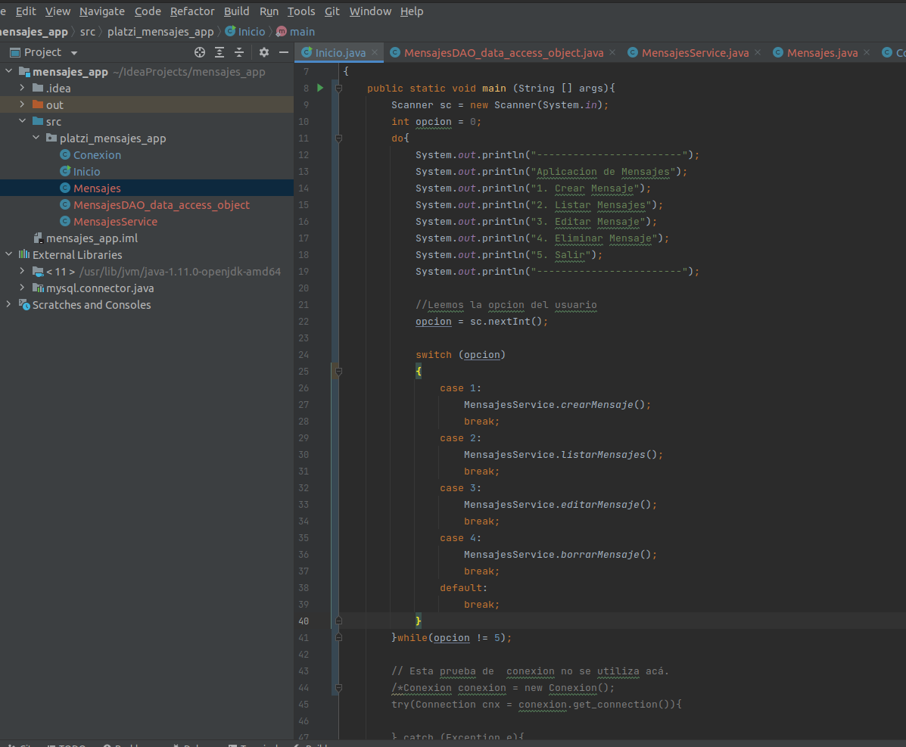
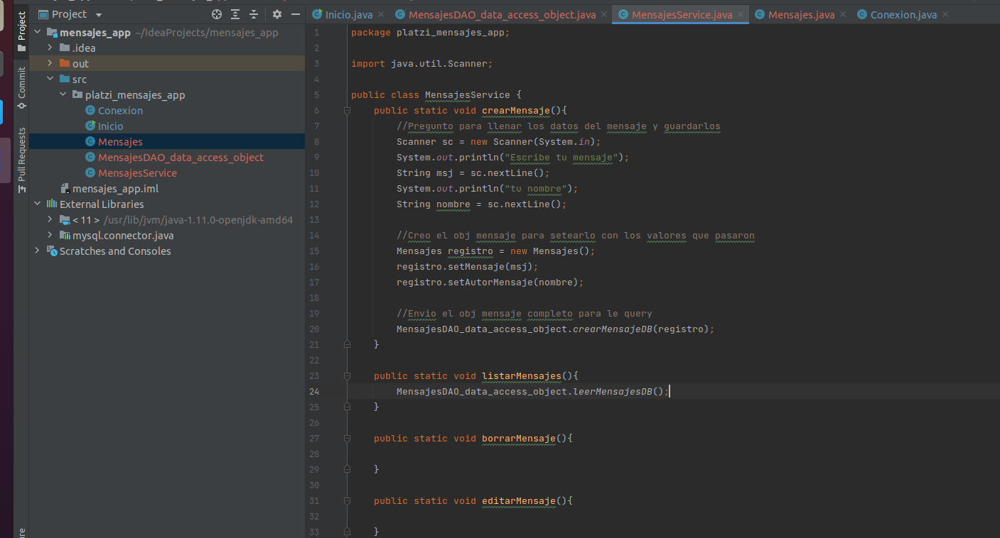
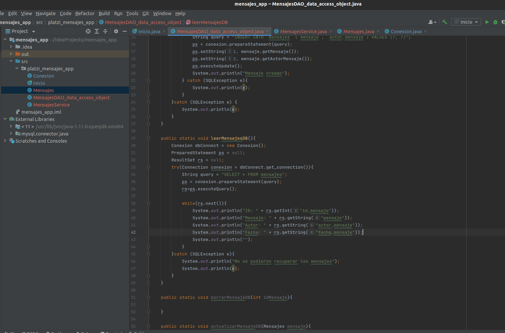
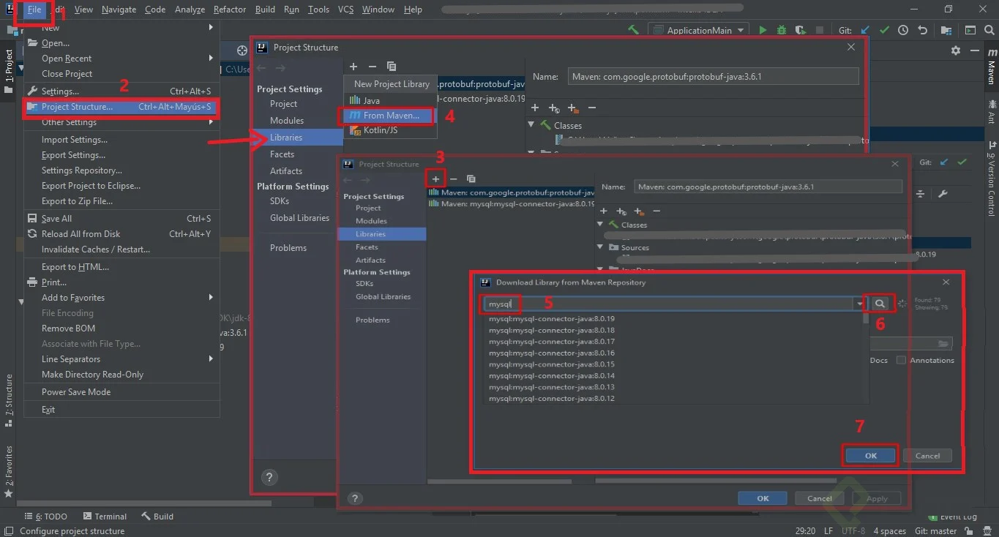
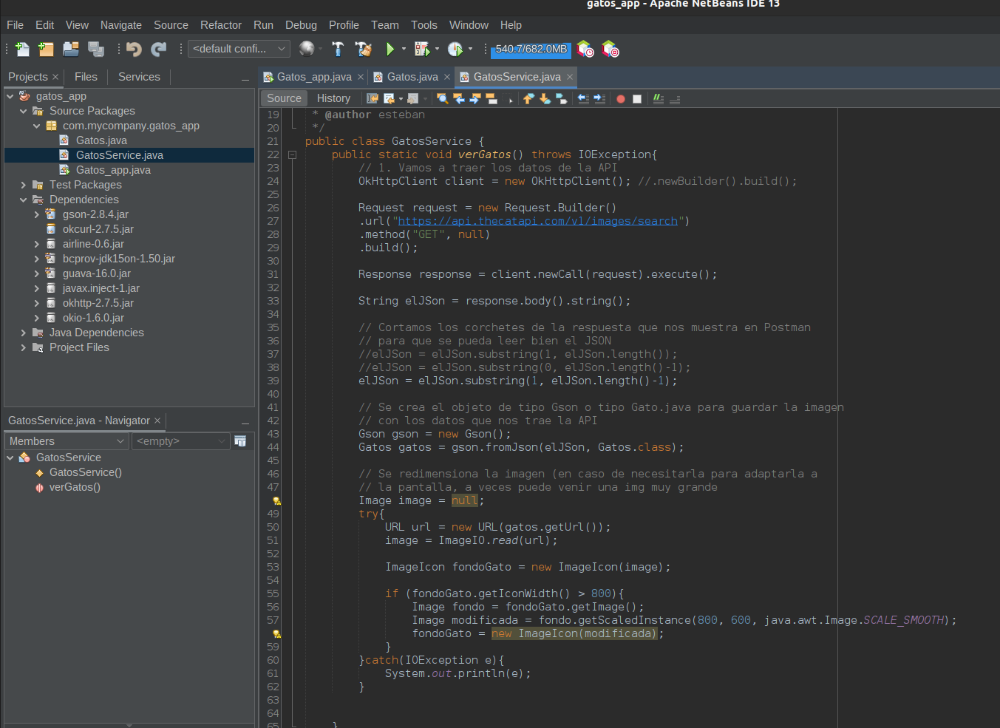
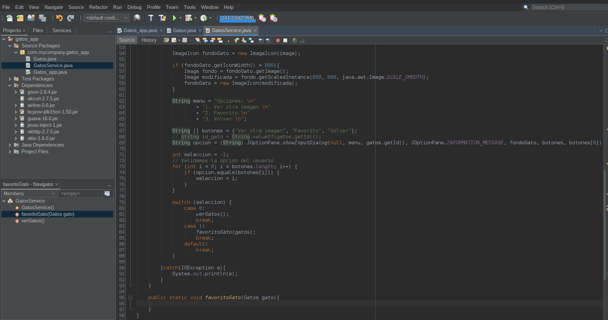
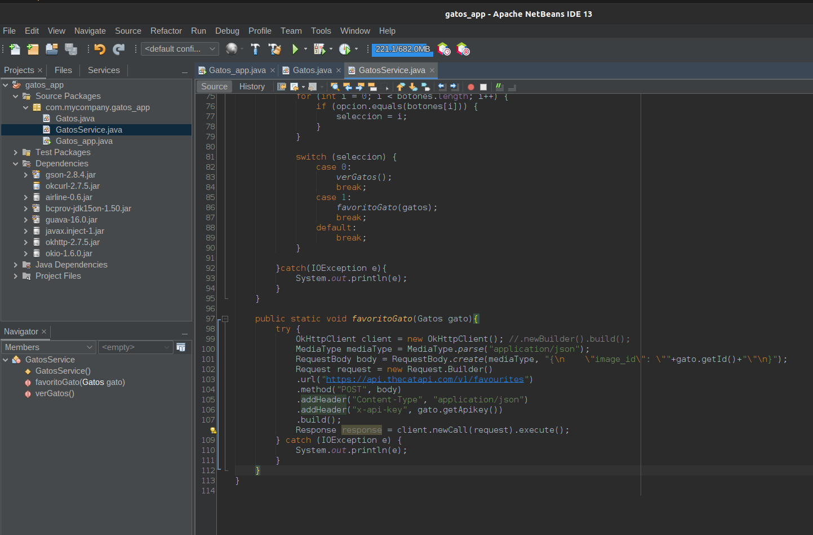
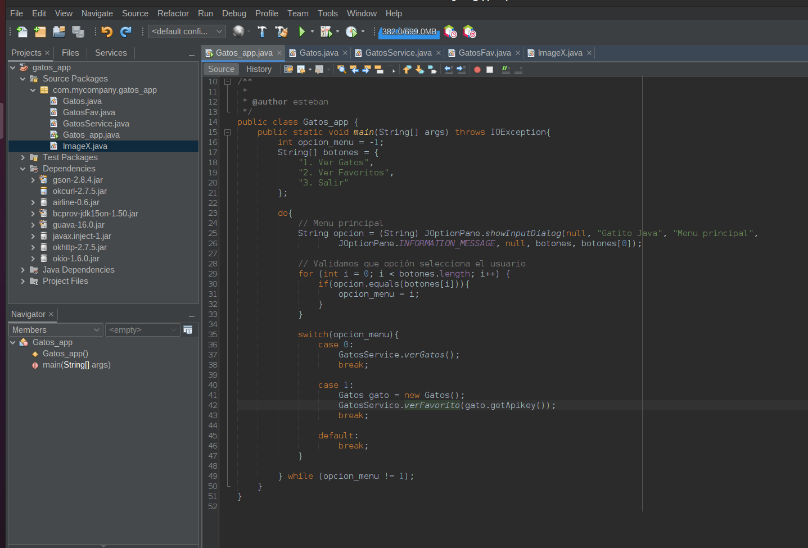
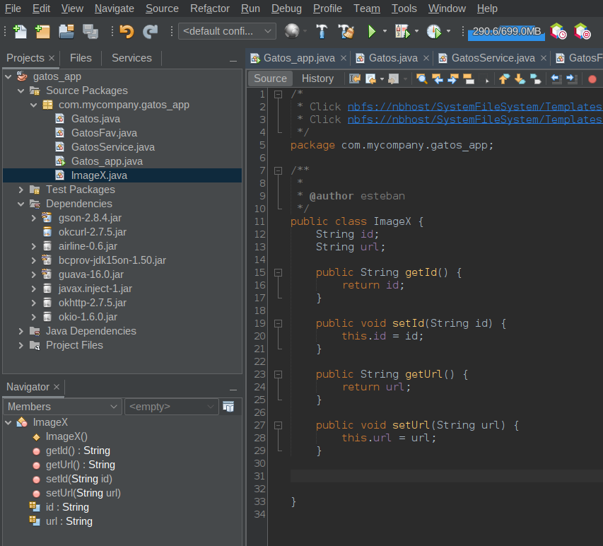
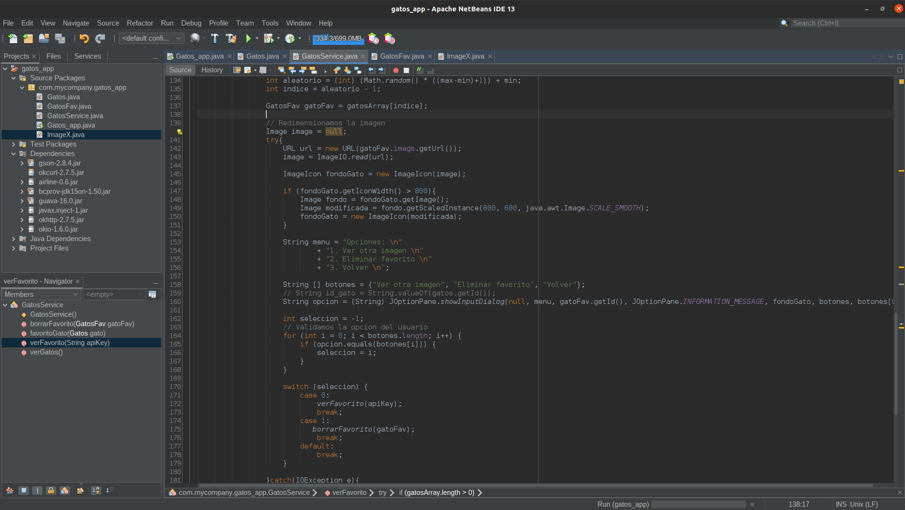

# Curso de Java SE Persistencia de Datos

- [Curso de Java SE Persistencia de Datos](#Curso-de-Java-SE-Persistencia-de-Datos)
    - [Modulo 3 Realizar operaciones CRUD y generar conexión](#modulo-3-Realizar-operaciones-CRUD-y-generar-conexión)
        - [Clase 8 Conexión a MySQL desde Java](#clase-8-Conexión-a-MySQL-desde-Java)
        - [Clase 9 Control de versiones con Git y GitLab](#clase-9-Control-de-versiones-con-Git-y-GitLab)
        - [Clase 10 Flujo y lógica de la aplicación](#clase-10-Flujo-y-lógica-de-la-aplicación)
        - [Clase 11 CRUD: inserción de datos](#Clase-11-CRUD-inserción-de-datos)
        - [Clase 12 CRUD: lectura de datos](#Clase-12-CRUD-lectura-de-datos)
        - [Clase 13 CRUD: eliminación de datos](#Clase-13-CRUD-eliminación-de-datos)
        - [Clase 14 CRUD: actualización de datos](#Clase-14-CRUD-actualización-de-datos)
    - [Módulo 4 Persistencia en API REST](#Modulo-4-Persistencia-en-API-REST)
        - [Clase 15 API REST y métodos HTTP](#Clase-15-API-REST-y-métodos-HTTP)
        - [Curso de API REST con PHP, profundización en las APIs](#Curso-de-API-REST-con-PHP-profundizacion-en-las-APIs)
        - [Clase 16 Conociendo algunas APIs](#Clase-16-Conociendo-algunas-APIs)
        - [Clase 17 Creación del proyecto y API KEY](#Clase-17-Creacion-del-proyecto-y-API-KEY)
        - [Clase 18 Listando datos de APIs públicas](#Clase-18-Listando-datos-de-APIs-publicas)
        - [Clase 19 Mostrar datos de la API en la aplicación](#Clase-19-Mostrar-datos-de-la-API-en-la-aplicacion)
        - [Clase 20 Guardando datos en APIs públicas](#Clase-20-Guardando-datos-en-APIs-publicas)
        - [Clase 21 Listar datos guardados](#Clase-21-Listar-datos-guardados)
        - [Clase 22 Mostrar favoritos](#Clase-22-Mostrar-favoritos)
        - [Clase 23 Eliminar datos de la API](#Clase-23-Eliminar-datos-de-la-API)

Empieza ya desarrollando el primer proyecto del curso, que permite ver y publica mensajes, muy similar a Twitter.

Utiliza [Draw IO](https://www.draw.io/) para hacer los diagramas del proyecto

## Modulo 3 Realizar operaciones CRUD y generar conexión

### Clase 8 Conección a Mysql desde Java

En la clase anterior vimos como crear un proyecto basico en NetBaens.

Ahora vamos a conectar esa aplicacion con una base de datos Mysql, con lo que necesitamos un conector, que es un plugin que te permite generar la conexion entre Java como aplicacion
y el motor de base de datos Mysql.

Vamos a utilizar la carpeta de Dependencias que es donde se instalan todas las dependencias o plugins que necesitemos para conectar Java con otros sistemas.

Buscamos el conector que se llama **mysql-connector-java**, seleccionamos la última versión y la agregamos.
Lo que hace es traer todos los plugins para trabajar con la base de datos.

**Ahora vamos a crear el código para conectarnos a esa BD.**

Creamos una nueva Clase Java, en la cual creamos un método que va a devolver un objeto de tipo Connection y la vamos a llamar get_connection, entonces este método va a tener
todas las funcionalidades para conectarnos a la BD y probar la conección.
Para esto definimos un objeto de tipo Connection, llamada connection. Importamos el paquete correspondiente (java.sql.Connection).

Mediante un bloque de Try-Catch tratamos de hacer la conección.
Drive Manager es un clase para hacer la conexion con la BD y le pasamos como parametro todos los datos que necesita:
El primero es "jdbc:mysql://localhost:3306/mensajes_app -> le pasamos la ruta de nuestro host, en este caso local host, el puerto donde corre el servicio de BD y el nombre de la BD.
El segundo parametro es el usuario de la BD, en este caso "root".
Tercer parametro la contraseña -> en este caso "" (vacio)

Esta configuración es una configuración que trae por defecto el paquete de herramientas que trae lampp, cuando estámos trabajando en producción es recomendable tener un propio usuario
de BD con una contraseña y tal vez usar otro puerto.

En Inicio, vamos a ejecutar y validar si verdaderamente la conexión es exitosa.

En el try le decimos que nos va a devolver un objeto de tipo Connection, un objeto llamado cnx que va a ser igual a conexion y llamamos al método get_connection().
Importamos también la clase java.sql.Connection.

Ya tenemos la conexxxion a la BD y ahora podemos empezar a desarrollar el proyecto.

### Clase 9 Control de versiones con Git y GitLab

Comentario
Para los que no hayan utilizado la consola para enlazar el repo de gitlab, estas son las instrucciones:

En la consola, navegar hasta la carpeta del proyecto
Iniciar el repositorio de git local
git init
Ir a la página de Github y crear el repositorio con el mismo nombre del proyecto.

…or create a new repository on the command line
echo "# mensajes_app" >> README.md
git init
git add README.md
git commit -m "first commit"
git branch -M main
git remote add origin https://github.com/FesCoder/mensajes_app.git
git push -u origin main

Con SSH
…or push an existing repository from the command line
git remote add origin https://github.com/FesCoder/mensajes_app.git
git branch -M main
git push -u origin main

//Seria lo de arriba.
Enlazar el repositorio:
git remote add origin git@gitlab.com:<tu usuario>/<el nombre de tu repo en gitlab>.git
Agregar un archivo .gitignore (recomiendo usar este)
https://gist.githubusercontent.com/Avinashachu007/58450a38a3a77d7c9923a55023f470f4/raw/eb564c6fc8f54d9f50e8902e4d119356b7d975cf/.gitignore

Agregar los archivos a stage
git add .
Hacer el commit
git commit -m “<Pon aqui el mensaje que quieras>”
Subir los cambios
git push -u origin main
Claro que antes debes configurar tu llave pública y privada de gitlab.

### Clase 10 Flujo y lógica de la aplicación

Hora de construir el Backend de nuestra app.
Vamos a crear una serie de capas y de clases en Java que nos van a permitir toda la comunicación entre el backend y nuestra base de datos.
Para ello vamos a utilizar una capa, la capa DAO (Data Access) que nos permite conectar a la BD y hacer las operaciones.
Una capa de servicios que va a recibir los datos desde un menú y que llama a la capa DAO para conectarse a la BD.
Y en la clase Inicio  ponemos el menú que va a permitir elegir entre las opciones.
Tambien creamos nuestra clase que contiene el modelo de Mensajes, ésta contiene la estructura basica para poder realizar las operaciones, aqui aplicamos todos los atributos
del proyecto que vimos.
Tenemos el primer constructor por defecto.
Creamos un segundo constructor para enviar todos los datos a nuestra base de datos cuando estemos creando un mensaje.
Y sus Getters and Setters.

En la clase DAO vamos a crear 4 métodos que conectaran con la base de datos

En la clase Service vamos a crear los métodos que va a recibir el menu y se conecta con la capa DAO para despues con la BD.

En la clase Inicio vamos a crear el menú con el que se interectuaran las 4 operaciones.

En este punto tenemos el menu en Inicio, que se conecta con la capa se servicios que es la que nos va a pedir los datos para poderlos almacenar en la BD o simplemente
traernos el listado de mensajes, y esa capa Service se conecta con la capa DAO que es la que finalmente ejecuta las instrucciones SQL para poder traer datos o guardarlos,
estas capas nos permite tener mas separada la app y tener el flujo de información.

### Clase 11 CRUD: inserción de datos

En esta clase vamos a utilizar las operaciones del CRUD “En informática, CRUD es el acrónimo de “Crear, Leer, Actualizar y Borrar” (del original en inglés: Create, Read, Update and Delete)
que se usa para referirse a las funciones básicas en bases de datos o la capa de persistencia en un software.”

Nuestra capa Service es el encargado de pedirnos los datos de los mensajes (Mensaje, Autor) y esta enviara sus parametros a la capa DAO, la cual se encargara de conectarse a la
BD y enviar los datos del mensaje.

Clase Service

Clase DAO

### Clase 12 CRUD: lectura de datos

En este caso vamos a utilizar de las operaciones del CRUD la de lectura, es decir traer los datos.
La capa de servicio se encargara de pedirle a la capa DAO que le solicite a la BD todos los mensajes que tenemos en nuestra tabla, las cuales vuelven a la capa DAO y esta a su vez
la devuelve a la capa Service para que se la pase a la capa de incio y podamos ver todos estos mensajes.

Clase Service
Solo se agregó la llamada al método leerMensajeBD para que DAO ejecute la query

Clase DAO

### Clase 13 CRUD: eliminación de datos

Ahora veremos como borrar un mensaje de nuestra BD.
Se le pedira al usuario el ID del mensaje que quiere borrar, ese ID sera llevado a la capa DAO y la capa DAO le dira a la BD que elimine el msj de acuerdo a ese ID.

Clase Service

Clase DAO

### Clase 14 CRUD: actualización de datos

Ahora vamos a pedirle al usuario en la actualización del mensaje que nos indique el id y el mensaje que quiere actualizar. Estos datos lo recibirá la capa DAO y
hace la act a la BD de ese ID.

Clase Service

Clase DAO

En este modulo aprendimos a hacer las 4 operaciones del CRUD -> Crear, Leer, Eliminar y Actualizar. Usan Java y una BD Mysql.

### Clase 15 API REST y métodos HTTP

En este módulo vamos a ver la persistencia de datos a traves de APIs o API REST (Application Programming Interfaces - Interfaz de programación de aplicaciónes) que es un conjunto
de recursos que dispone una empresa u organización para que un tercero podamos consumir la información que ellos disponen. Las APIs son un método de comunicación que le permite a
terceros comunicarse entre si para transferir información y realizar las 4 operaciónes básicas pero esta vez no utilizando el CRUD si no métodos HTTP.

Las APIs funcionan bajo el estandar o protocolo HTTP que es el con el que funcionan los sitios web y estos utilizan unos métodos que sirven para las 4 operaciónes.
Cuando queremos obtener información de una API utilizamos el método GET, cuando queremos guardar o enviar usamos el método POST, para actualizar info en ese recurso o API externa
podemos usar el método PUT o PATCH y cuando queremos borrar utilizamos el método DELETE.

Las APIs funcionan en diferentes formatos, tenemos el JSON, que es el estandar para las APIs REST y también tenemos el formato XML que se utilizaban en otro tipos de APIs en años ant.

### Curso de API REST con PHP, profundización en las APIs

**API**
La palabra API es un acrónimo que significa Interfaz de Programación de Aplicaciones (Application Programming Interface). Es un sistema que funciona como intermediario entre diferentes
aplicaciones de software y su función es permitir que estas aplicaciones puedan comunicarse entre sí. Cada vez que usas una app como WhatsApp, Instagram o Facebook, estás usando una API
sin saberlo.

**Curl**
es una herramienta de línea de comandos y bibliotecas con la cual es posible transferir datos a través de una URL con diversas opciones de seguridad.
Curl es compatible con protocolos como DICT, FILE, FTP, FTPS, Gopher, HTTP, HTTPS, IMAP, IMAPS, LDAP, LDAPS, MQTT, POP3, SCP, SFTP, SMB, SMBS, SMTP, SMTPS, Telnet and TFTP, certificados
SSL HTTP POST, HTTP PUT y muchos más.
La utilidad Curl hace uso de líneas de comandos o scripts para llevar a cabo la transferencia de los datos, es por ello que es una de las herramientas más populares.

**HTTP**
HTTP (Hypertext Transfer Protocol), en español: Protocolo de Transferencia de Hipertexto, es un protocolo estándar que gestiona la conexión de los servidores web con los navegadores.

Qué es HTTP
Es un protocolo de comunicación entre aplicaciones basado en el intercambio de texto. El protocolo HTTP es el que impulsa todo internet. Los navegadores web utilizan este protocolo para
solicitar páginas web a los servidores. El servidor devuelve todos los datos necesarios en código HTML para que puedan mostrarse en el navegador.

Qué es un protocolo
Es conjunto de reglas en las que se van a comunicar dos entidades, en este caso dos computadoras. El modelo TCP/IP nos permite esta comunicación entre computadoras.

Como funciona el protocolo HTTP
El cliente envía una petición, se transmite por internet.
El servidor recibe la petición y genera una respuesta, la envía.
El cliente recibe la respuesta (y si estamos en el navegador, interpreta lo recibido).

**REST**
REST es un acrónimo que significa Representational State Transfer o transferencia de estado representacional en español. Le agrega una capa muy delgada de complejidad y abstracción a HTTP.
Mientras que HTTP es transferencia de archivos, REST se basa en la transferencia de recursos.

Cómo funciona REST
REST es un conjunto de principios que definen la forma en que se deben crear, leer, actualizar y eliminar los datos. Es una arquitectura conocida como cliente-servidor, en la que el
servidor y el cliente actúan de forma independiente, siempre y cuando la interfaz sea la misma al procesar una solicitud y una respuesta, que son los elementos esenciales. El servidor
expone la API REST y el cliente hace uso de ella. El servidor almacena la información y la pone a disposición del usuario, mientras que el cliente toma la información y la muestra al
usuario o la utiliza para realizar posteriores peticiones de más información.

REST es muy útil cuando:
Las interacciones son simples.
Los recursos de tu hardware son limitados.

Qué es una API RESTful
Una API RESTful es una interfaz que utiliza estos principios para comunicarse hacia y desde un servidor. Está diseñada con los conceptos de REST. El principio más importante en las APIs
RESTful es el uso de los métodos HTTP:
- GET -> para obtener un recurso del servidor del servidor, podes obtener colecciones de recursos como recursos puntuales.
- POST - para crear un recurso del servidor
- PUT -> para actualizar un recurso del servidor. Se tiene que reemplaza toda la información, se debe enviar completa.
- PATCH -> Para hacer una modificacion especifica del elemento.
- DELETE -> Para borrar un recurso del servidor.
Estos métodos son empleados por los clientes para crear, manipular y eliminar datos en los servidores, respectivamente.

Elementos de una API RESTful
Recurso: todo dentro de una API RESTful debe ser un recurso.
URI: los recursos en REST siempre se manipulan a partir de la URI, identificadores universales de recursos.
Acción: todas las peticiones a tu API RESTful deben estar asociadas a uno de los verbos de HTTP: GET para obtener un recurso, POST para escribir un recurso, PUT para modificar un recurso y
DELETE para borrarlo.

Comentarios
Una petición REST completa se basa en:
- URL(Dominio, protocolo)
- Verbo HTTP (GET, PUT, POST, DELETE)
¿Cuándo conviene usar REST?
- Interacciones simples (agregar recursos, quitarlos, modificarlos)
- Recursos limitados
¿Cuándo NO conviene usar REST?
- Cuando las interacciones son más complejas, ejemplo cuándo necesitamos que el servidor aporte más lógica.

REST permite mandar json, xml, binarios (imágenes, documentos), text, etc. en cambio con SOAP que solo permite la transmisión de datos en formato XML, json es mucho mas liviano y rapido en
su procesamiento dado que es interpretado de forma natural por javascript.
REST como SOAP son bastante capaces de atender grandes volúmenes de información, yo creo hay que analizar que es más conveniente para uno, tanto en tiempo de desarrollo, tecnologías y
sobre que dispositivos o tipos de APP se van a consumir, SOAP se utiliza mas en aplicaciones financieras.

REST (Representational State Transfer)
HTTP: HyperText Transfer Protocol
URI: Uniform Resource Identifier
URL: Uniform Resource Locator

Levantar un servidor: php -S tudominio.local.com:8000 nombreArchivo.formato
Para hacer consulta CURL: curl http://tudominio.local.com:8000
Para hacer consulta CURL con más detalles: curl http://tudominio.local.com:8000 -v
Consecuentemente, Definimos los recursos disponibles, declarando los parametros que van a pasar por el Query string, luego validamos que el recurso esté disponible, en caso de no estarlo
podemos detener la ejecución del script, luego de esto definimos los recursos (En la vida real, los libros estarían disponibles en una DB) y finalmente validamos la respuesta asumiendo que
el pedido es correcto.

**Tipos de Autenticacion vía HTTP**
La autenticación vía HTTP tiene dos problemas:
Es poco segura: las credenciales se envían en cada request anteponiendo el usuario y contraseña en la url, por ejemplo: user:password@platzi.com.
Es ineficiente: la autenticación se debe realizar en cada request.

**Autenticación vía HMAC (Hash-based Message Authentication Code - Código de autenticación de mensajes basado en hash)**
Para esta autenticación necesitamos 3 elementos:
Función Hash: Difícil de romper, que sea conocida por el cliente y servidor.
Clave secreta: Solamente la pueden saber el cliente y el servidor, será utilizada para corroborar el hash.
UID: El id del usuario, será utilizado dentro de la función hash junto con la clave secreta y un timestamp.
Es mucho más segura que la autenticación vía HTTP, por ello la información que se envía a través de este método no es muy sensible.

**Autenticación vía Access Tokens**
Está forma es la más compleja de todas, pero también es la forma más segura utilizada para información muy sensible. El servidor al que le van a hacer las consultas se va a partir en dos:

Uno se va a encargar específicamente de la autenticación.
El otro se va a encargar de desplegar los recursos de la API.
El flujo de la petición es la siguiente:

Nuestro usuario hace una petición al servidor de autenticación para pedir un token.
El servidor le devuelve el token.
El usuario hace una petición al servidor para pedir recursos de la API.
El servidor con los recursos hace una petición al servidor de autenticación para verificar que el token sea válido.
Una vez verificado el token, el servidor le devuelve los recursos al cliente.

**Manejo de errores de un servicio REST**
De momento nuestra API no nos indica que haya ocurrido un error, solamente nos regresa un código 200 de HTTP que significa que la petición se realizó sin problemas.

Para mejorar nuestra API añadiremos respuestas con los códigos HTTP más comunes:
400 Bad Request: indica que el servidor no puede o no procesa la petición debido a algo que es percibido como un error del cliente
404 Not Found: el servidor no encuentra el recurso solicitado.
500 Internal Server Error: la petición no pudo procesarse por un error del servidor.

Los códigos de estado en HTTP se clasifican en varios tipos:
- 1xx: Respuestas informativas
- 2xx: Peticiones correctas
- 3xx: Redirecciones
- 4xx: Errores del cliente
- 5xx: Errores del servidor
Los más comunes:
- 400 Bad Request: Error en la petición.
- 401 Unauthorized: Falta iniciar sesión.
- 403 Forbidden: No se poseeen los permisos necesarios.
- 404 Not Found: No se ha podido encontrar el recurso.
- 500 Internal Server error: Usualmente fallo en la aplicación web.
- 502 Bad Gateway: Error entre la comunicación del servidor web y alguno de los servidores que actúan de proxy.
- 503 Service Unavailable: Servidor está caido por mantenimiento o está sobrecargado.
- 504 Gateway Timeout: El servidor actúa como puerta de enlace y no puede obtener una respuesta a tiempo.

**Introducción a Ajax**
Es muy común tener comunicaciones con API REST al momento de tener una aplicación de una sola página o SPA, ya sea para obtener o guardar datos. Esta comunicación se realiza a través de
AJAX, Asynchronous JavaScript And XML. la clave es la parte de asincronismo pues el cliente no se queda bloqueado.

Un escenario muy común de comunicación vía Rest API lo constituye las single page application, en este escenario lo que sucede es que el cliente necesita comunicarse con el servidor para
obtener más datos o hacer una actualización. Todo esto se vasa en una tecnología llamada AJAX, que significa Asynchronous Javascript XML.

Cómo funciona
El cliente hace una petición HTTP GET
Obtiene HTML + JS y el navegador interpreta todo para mostrar la página, cuando tú haces clic en algún botón o algo parecido
En ese momento, se dispara un nuevo pedido al servidor, este es el pedido que viaja vía AJAX y del otro lado, hay un servidor de tipo Restful que responderá con información JSON
Una vez que llegue el JSON al navegador del cliente, JS se va a encargar de tomar estos datos y ponerlos en la estructura.

Ajax es una tecnologia y una manera de realizar peticiones asincronas desde los navegadores web utilizando el objeto XMLHttpRequest.
Actualmente lo navegadores modernos proveen una libreria llamada fetch para realizar estas llamadas sin necesidad de instalar nada.
Lo digo por que en ocasiones la gente se confunde y cre ajax es solo la libreria de jquery. angular usa ajax, react y en la actualidad casi cualquier sitio web.

https://www.youtube.com/watch?v=_ybgWmSCAu8

Bootstrap, es un framework, te permite crear interfaces web con CSS y JavaScript, cuya particularidad es la de adaptar la interfaz del sitio web al tamaño del dispositivo en que se
visualice. Es decir, el sitio web se adapta automáticamente al tamaño de una PC, una Tablet u otro dispositivo. Esta técnica de diseño y desarrollo se conoce como “responsive design” o
diseño adaptativo.

Funcion Anónima -> Es una funcion que se crea cuando se ejecuta.

Recuerda seguir las buenas prácticas:
Siempre utiliza sustantivos para nombrar tus recursos.
Añade los nombres en plural para las urls.
Las modificaciones a recursos deben hacerse con su verbo HTTP correspondiente: POST, PUT o DELETE.
Para devolver recursos asociados a otro recurso utiliza url que incorporen subrecursos: /Autos/1/Choferes.
Navegabilidad vía vínculos.
Cuando devuelvas colecciones deben ser filtrables, ordenables y paginables.
Versiona tu API, añade el número de versión en la url: v1/Autos.
No olvides tomar el examen para evaluar tus conocimientos y dejar una review del curso.

### Clase 16 Conociendo algunas APIs
En esta clase se descargó Postman, que prueba el funcionamiento de las APIs, que información nos trae y su generación de código para poder implementarlo en nuestro proyecto.  
En este caso se utilizo una [API de Gatos](https://thecatapi.com/) y usamos [este](https://api.thecatapi.com/v1/images/search?limit=5&page=10&order=Desc) para generar una imagen
aleatoria.

### Clase 17 Creación del proyecto y API KEY
Vamos a registarnos en las APIs para obtener la API KEY, que es basicamente un código llave que se usa cada vez que se realiza una petición a la API para poder autenticarnos.  
Adicionalmente empezamos a crear la estrucura del proyecto.  
Nos registramos en 'The Cat API', nos llega un correo con nuestra API KEY y abro Intellij IDEA para desarrollar el proyecto.  

En este caso vamos a utilizar dos librerias o dependencias importantes, una es OKHTTP, que es el cliente o la dependencia que nos va a permitir conectar Java con APIs publicas y la otra
dependencia se llama GSON, que nos permite serializar objetos, es decir que la respuesta que obtuvimos de la API la vamos a poder convertir en un array o un objeto dentro de
Java para poder manipular los datos.

Descargar dependencias en Intellij

Clase que creamos

### Clase 18 Listando datos de APIs públicas

### Clase 19 Mostrar datos de la API en la aplicación
En esta clase se visualizo la imagen del Gato desde un menú.

### Clase 20 Guardando datos en APIs públicas
En esta clase se va a mostrar como marcar como Favorito la imagen de un gato y se enviara por POST a la API.
La API te puede generar el código en Java con HTTPOK o también se puede realizar desde Postman

### Clase 21 Listar datos guardados
Los favoritos anteriores quedan guardados en la API de TheCatApi, ahora vamos a mostrarlos.
Primero modificamos el menú

Y Ahora agregamos la lógica en una nueva función para mostrar el listado de gatos favoritos

Tambien agregamos dos clases nuevas para tratar los atributos que nos devuelve la API

GatosFav.java  

ImageX.java  

### Clase 22 Mostrar favoritos
Las últimas clases ya se ve mas el desorden y la falta de buenas prácticas del profesor, no hay que guiarse mucho por estas capturas pero las subo a fuerza de terminarlo.  
Se corrigió la formula para obtener un numero aleatorio (un +1 donde habia un -1).  
Básicamente se copio y pego desp el codigo para redimensionar la imagen, con algunas modificaciónes y el agregado de la función borrarFavorito().

### Clase 23 Eliminar datos de la API
Vamos a escribir el código para eliminar gatos de los favoritos, es decir ejecutaremos la operación DELETE sobre la API.

[Link](https://github.com/santiaguf/gatos_app) del repositorio actualizado del profesor con mejores prácticas 
