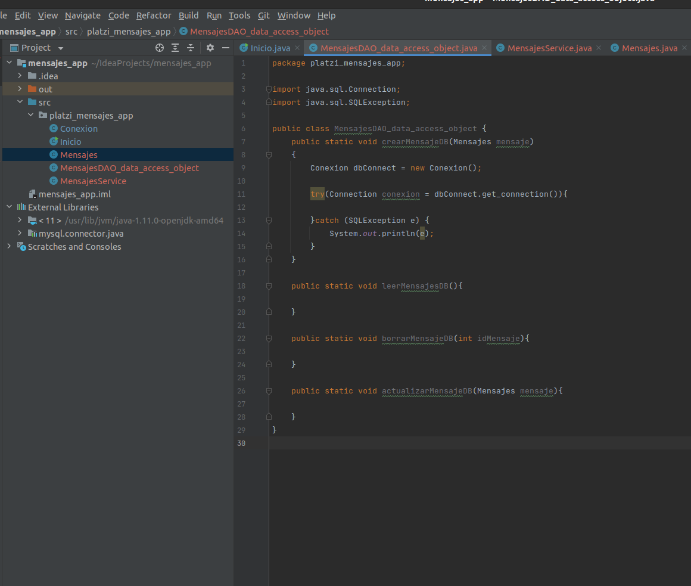
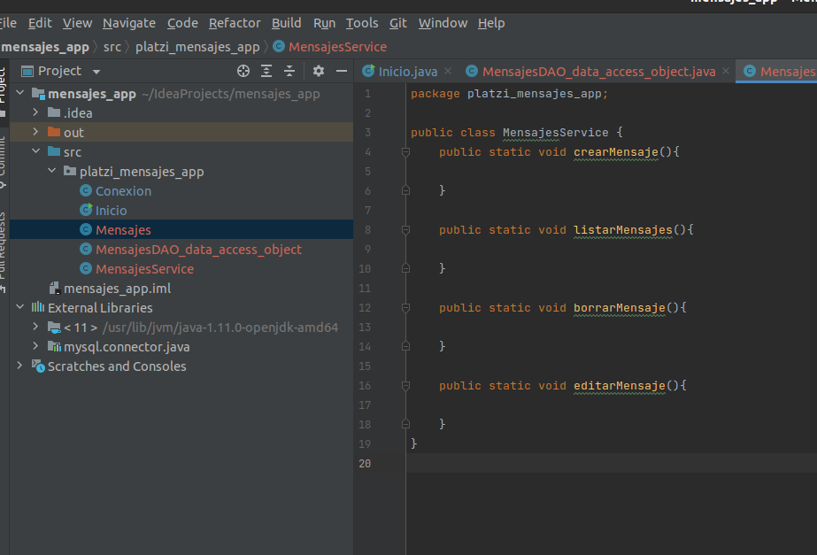

# Curso de Java SE Persistencia de Datos

- [Curso de Java SE Persistencia de Datos](#Curso-de-Java-SE-Persistencia-de-Datos)
    - [Modulo 3 Realizar operaciones CRUD y generar conexión](#modulo-3-Realizar-operaciones-CRUD-y-generar-conexión)
        - [Clase 8 Conexión a MySQL desde Java](#clase-8-Conexión-a-MySQL-desde-Java)
        - [Clase 9 Control de versiones con Git y GitLab](#clase-9-Control-de-versiones-con-Git-y-GitLab)
        - [Clase 10 Flujo y lógica de la aplicación](#clase-10-Flujo-y-lógica-de-la-aplicación)
        - [Clase 11 CRUD: inserción de datos](#Clase-11-CRUD:-inserción-de-datos)

Empieza ya desarrollando el primer proyecto del curso, que permite ver y publica mensajes, muy similar a Twitter.

Utiliza [Draw IO](https://www.draw.io/) para hacer los diagramas del proyecto

## Modulo 3 Realizar operaciones CRUD y generar conexión

### Clase 8 Conección a Mysql desde Java

En la clase anterior vimos como crear un proyecto basico en NetBaens.

Ahora vamos a conectar esa aplicacion con una base de datos Mysql, con lo que necesitamos un conector, que es un plugin que te permite generar la conexion entre Java como aplicacion
y el motor de base de datos Mysql.

Vamos a utilizar la carpeta de Dependencias que es donde se instalan todas las dependencias o plugins que necesitemos para conectar Java con otros sistemas.

Buscamos el conector que se llama **mysql-connector-java**, seleccionamos la última versión y la agregamos.
Lo que hace es traer todos los plugins para trabajar con la base de datos.

**Ahora vamos a crear el código para conectarnos a esa BD.**

Creamos una nueva Clase Java, en la cual creamos un método que va a devolver un objeto de tipo Connection y la vamos a llamar get_connection, entonces este método va a tener
todas las funcionalidades para conectarnos a la BD y probar la conección.
Para esto definimos un objeto de tipo Connection, llamada connection. Importamos el paquete correspondiente (java.sql.Connection).

Mediante un bloque de Try-Catch tratamos de hacer la conección.
Drive Manager es un clase para hacer la conexion con la BD y le pasamos como parametro todos los datos que necesita:
El primero es "jdbc:mysql://localhost:3306/mensajes_app -> le pasamos la ruta de nuestro host, en este caso local host, el puerto donde corre el servicio de BD y el nombre de la BD.
El segundo parametro es el usuario de la BD, en este caso "root".
Tercer parametro la contraseña -> en este caso "" (vacio)

Esta configuración es una configuración que trae por defecto el paquete de herramientas que trae lampp, cuando estámos trabajando en producción es recomendable tener un propio usuario
de BD con una contraseña y tal vez usar otro puerto.

En Inicio, vamos a ejecutar y validar si verdaderamente la conexión es exitosa.

En el try le decimos que nos va a devolver un objeto de tipo Connection, un objeto llamado cnx que va a ser igual a conexion y llamamos al método get_connection().
Importamos también la clase java.sql.Connection.

Ya tenemos la conexxxion a la BD y ahora podemos empezar a desarrollar el proyecto.

### Clase 9 Control de versiones con Git y GitLab

Comentario
Para los que no hayan utilizado la consola para enlazar el repo de gitlab, estas son las instrucciones:

En la consola, navegar hasta la carpeta del proyecto
Iniciar el repositorio de git local
git init
Ir a la página de Github y crear el repositorio con el mismo nombre del proyecto.

…or create a new repository on the command line
echo "# mensajes_app" >> README.md
git init
git add README.md
git commit -m "first commit"
git branch -M main
git remote add origin https://github.com/FesCoder/mensajes_app.git
git push -u origin main

Con SSH
…or push an existing repository from the command line
git remote add origin https://github.com/FesCoder/mensajes_app.git
git branch -M main
git push -u origin main

//Seria lo de arriba.
Enlazar el repositorio:
git remote add origin git@gitlab.com:<tu usuario>/<el nombre de tu repo en gitlab>.git
Agregar un archivo .gitignore (recomiendo usar este)
https://gist.githubusercontent.com/Avinashachu007/58450a38a3a77d7c9923a55023f470f4/raw/eb564c6fc8f54d9f50e8902e4d119356b7d975cf/.gitignore

Agregar los archivos a stage
git add .
Hacer el commit
git commit -m “<Pon aqui el mensaje que quieras>”
Subir los cambios
git push -u origin main
Claro que antes debes configurar tu llave pública y privada de gitlab.

### Clase 10 Flujo y lógica de la aplicación

Hora de construir el Backend de nuestra app.
Vamos a crear una serie de capas y de clases en Java que nos van a permitir toda la comunicación entre el backend y nuestra base de datos.
Para ello vamos a utilizar una capa, la capa DAO (Data Access) que nos permite conectar a la BD y hacer las operaciones.
Una capa de servicios que va a recibir los datos desde un menú y que llama a la capa DAO para conectarse a la BD.
Y en la clase Inicio  ponemos el menú que va a permitir elegir entre las opciones.
Tambien creamos nuestra clase que contiene el modelo de Mensajes, ésta contiene la estructura basica para poder realizar las operaciones, aqui aplicamos todos los atributos
del proyecto que vimos.
Tenemos el primer constructor por defecto.
Creamos un segundo constructor para enviar todos los datos a nuestra base de datos cuando estemos creando un mensaje.
Y sus Getters and Setters.

En la clase DAO vamos a crear 4 métodos que conectaran con la base de datos

En la clase Service vamos a crear los métodos que va a recibir el menu y se conecta con la capa DAO para despues con la BD.

En la clase Inicio vamos a crear el menú con el que se interectuaran las 4 operaciones.

En este punto tenemos el menu en Inicio, que se conecta con la capa se servicios que es la que nos va a pedir los datos para poderlos almacenar en la BD o simplemente
traernos el listado de mensajes, y esa capa Service se conecta con la capa DAO que es la que finalmente ejecuta las instrucciones SQL para poder traer datos o guardarlos,
estas capas nos permite tener mas separada la app y tener el flujo de información.

### Clase 11 CRUD: inserción de datos

En esta clase vamos a utilizar las operaciones del CRUD “En informática, CRUD es el acrónimo de “Crear, Leer, Actualizar y Borrar” (del original en inglés: Create, Read, Update and Delete)
que se usa para referirse a las funciones básicas en bases de datos o la capa de persistencia en un software.”

Nuestra capa Service es el encargado de pedirnos los datos de los mensajes (Mensaje, Autor) y esta enviara sus parametros a la capa DAO, la cual se encargara de conectarse a la
BD y enviar los datos del mensaje.

Clase Service

Clase DAO
